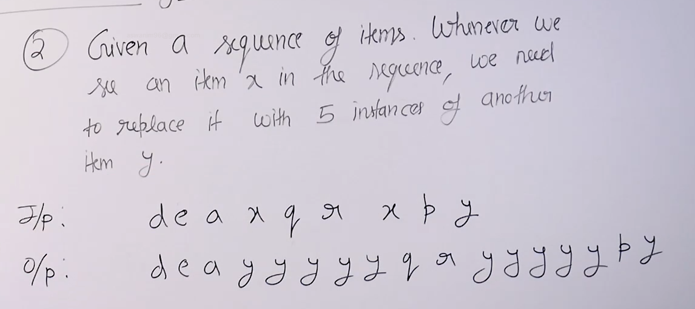

### Issues with using arrays :

* Either the size is fixed and pre-allocated or the worst case for insertion in dynamic array is theta(n).

* Insertion and deletion in the middle or beginning of the array is costly.(have to move all the elements on the left or right one position ahead)

* Efficient implementatation of queue and dequeue is very difficult.

### Problems which are hard to implement in array :

* Hard to implement round robin scheduling with arrays but with circular linked list it is very easy.

* 

* Its hard to merge sorted sequences frequently in array cause we will always need an extra space to store the merged sequence. But if we use linked list then we do not need to allocate extra space for next linked list.

* Another practical issue with using arrays is that when the memory available to us is in terms of fragment then we cannot allocate large contiguous memories for array. But if we were using linked list then this problem wont arise because it does not use contigous memory.
