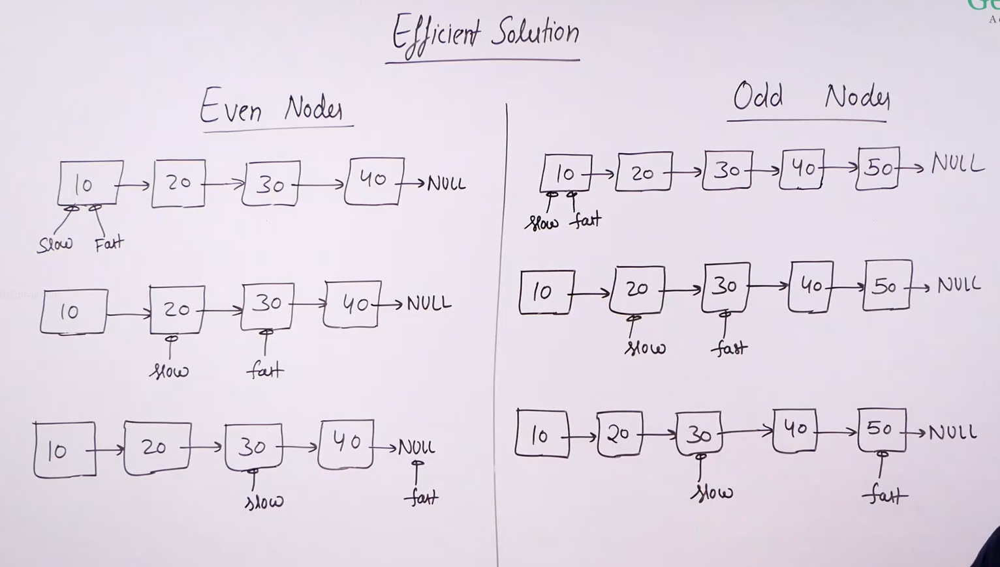

# Slow and fast traversal : 

* 

* To find the middle of a linked list we use the concept of slow and fast traversal of pointers.

* In this one pointer moves two nodes at a time and another one moves one node at a time.

* So by the time one pointer reaches end of the list, the other pointer will be in the middle of the list.