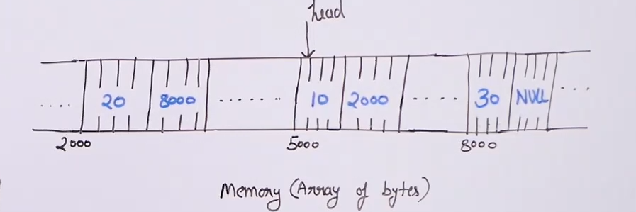

# Linked list :

* Linked list is a linear , sequencial data structure like arrays. But unlike arrays, linked list does not store its data in contiguous memory locations.

* Instead of storing elements in contigous locations each element/node of linked list contains a reference to the next element/node. And it can directly access that element though that reference.

* Due to this insertion and deletion at any point in the linked list is very efficient.

* Last element in the linked list contains a reference to null.

* Another advantage of using linked list is that we do not need to pre-allocate memory for the linked list. Because we can dynamically allocate memory as and when required and just add the reference to it at the element before it.

* This saves a lot of memory.

* 