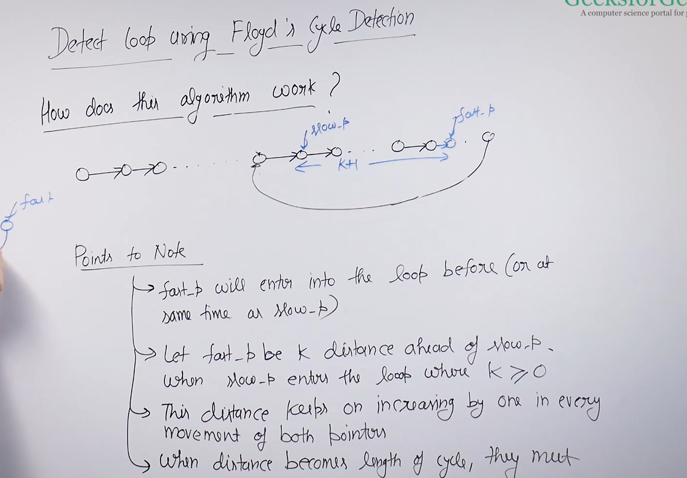
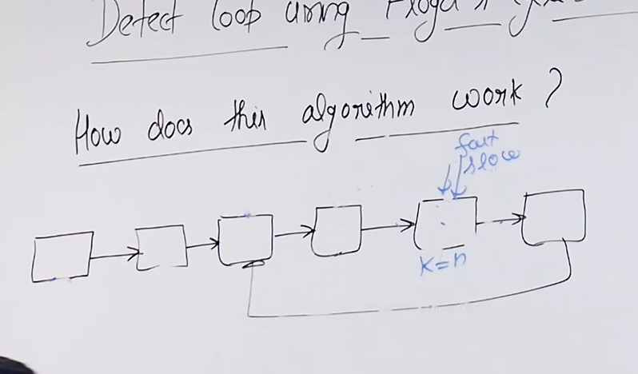
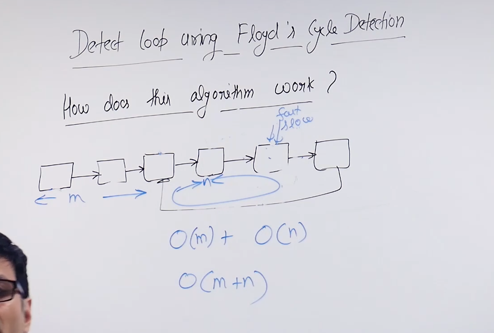

# Proof to Floyd's cycle detection algorithm :

* 

* The reason we increment the fast pointer two times and not by any other number is because if it was something else the distance between slow and fast pointer won't increase by one so it might or might not becomes equal to n (size of loop).

* 

* 

* m+n is the length of the linked list.