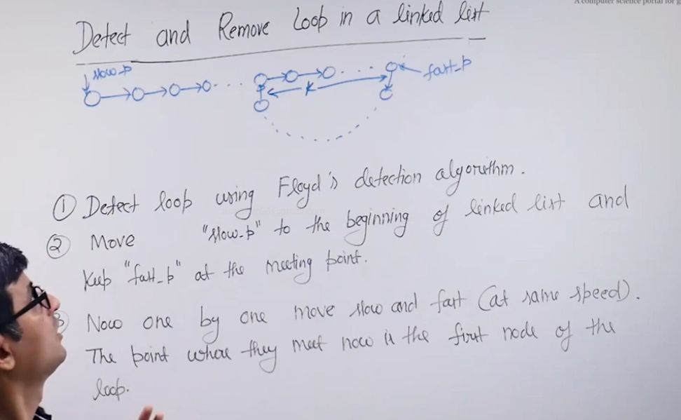
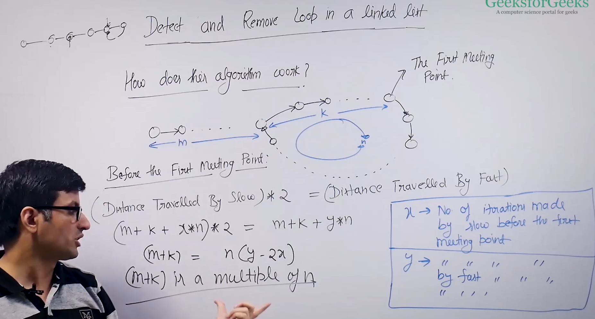
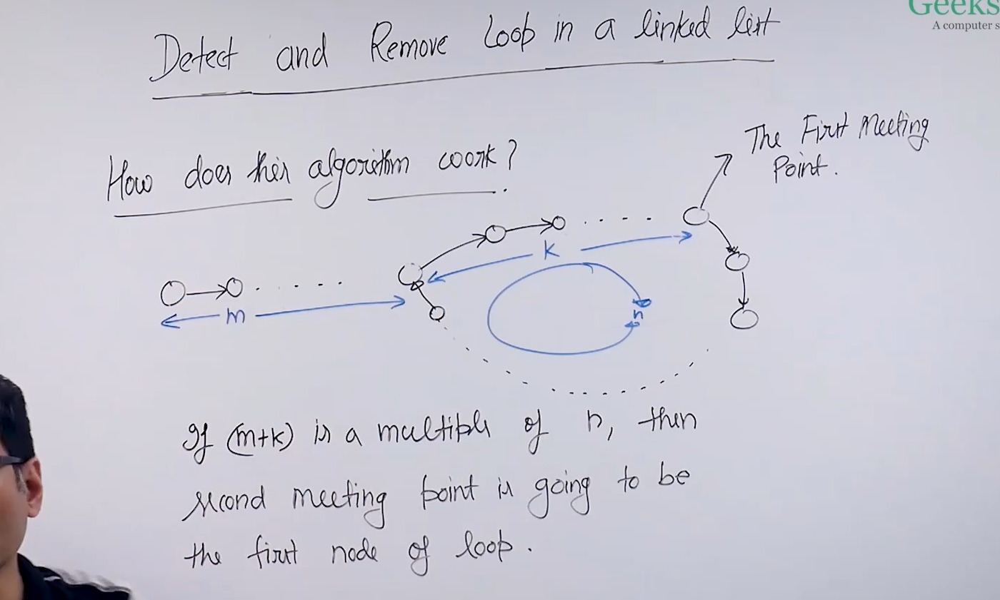

# Proof to Floyd's cycle detection algorithm :

* 

* Proof : 

* Hence : 

* So if (m+k) is a mutiple of n then the amount of time slow ptr moves from beginning of ll to starting pt of loop, is the amount of time fast node will take to reach the starting pt of loop.

* Variation of this problem : 1) Find length of loop.
                              2) Find the first node of loop.