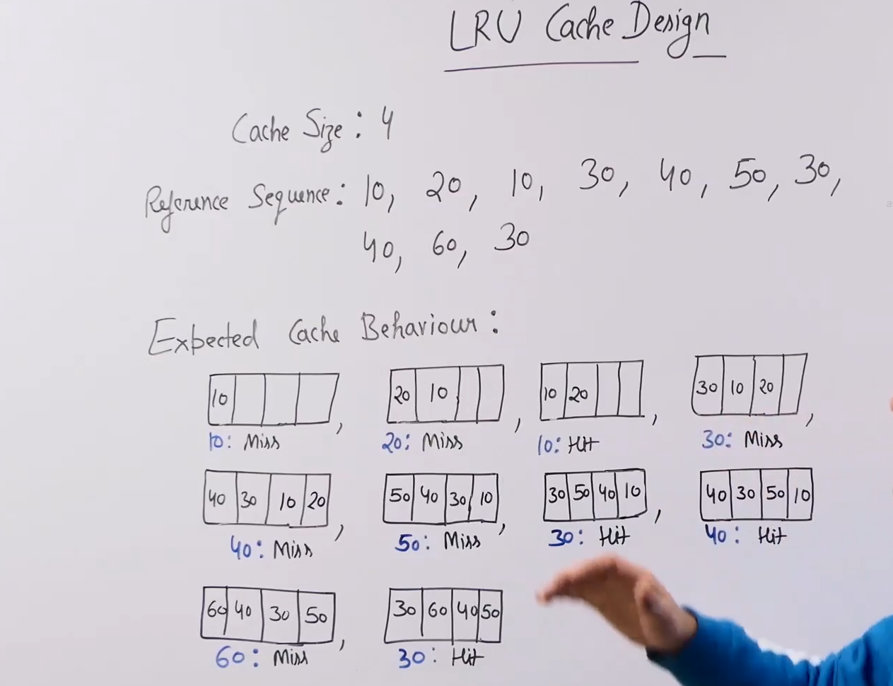
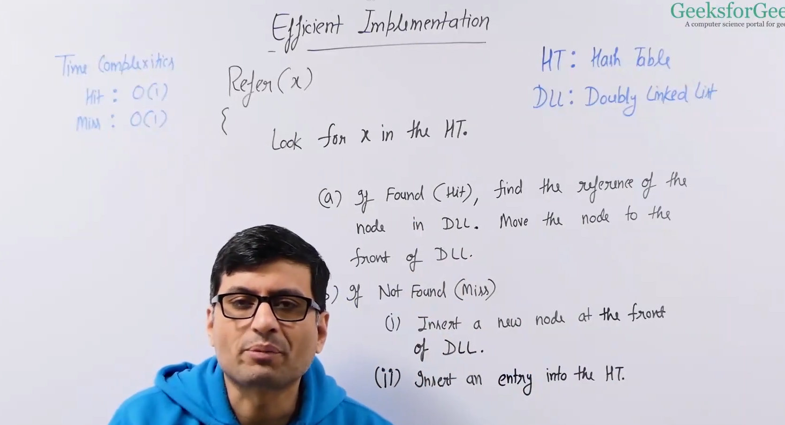

# LRU :

* Cache is a memory which is very close to the cpu and has very less access time but its small in size compared to ram.Since cache is very very small we need to have efficient utilization of this memory.

* LRU is one of the technique for this purpose , LRU stands for least recently used and the concept that LRU uses is called temporal locality which means that the item is accessed now is very likely to be access in the near future.

* In LRU we keep the recently accessed item in the memory and we remove the least recently accessed item when we need space in the memory.

* Example : 

* When something is not there in the cache we call it a miss and when it is in the cache we call it a hit.

* LRU design question : we need to design a data structure which perform the following alogorithm : 
    * We will be given a capacity internally.

    * When we are given a item , if its there in the cache we mark it as most recently used. 
    
    * If its not there and if cache has empty space then we insert it and mark it as most recently used.

    * And if the cache is full we remove the least recently used item and insert the new item and mark it as most recently used.

* 