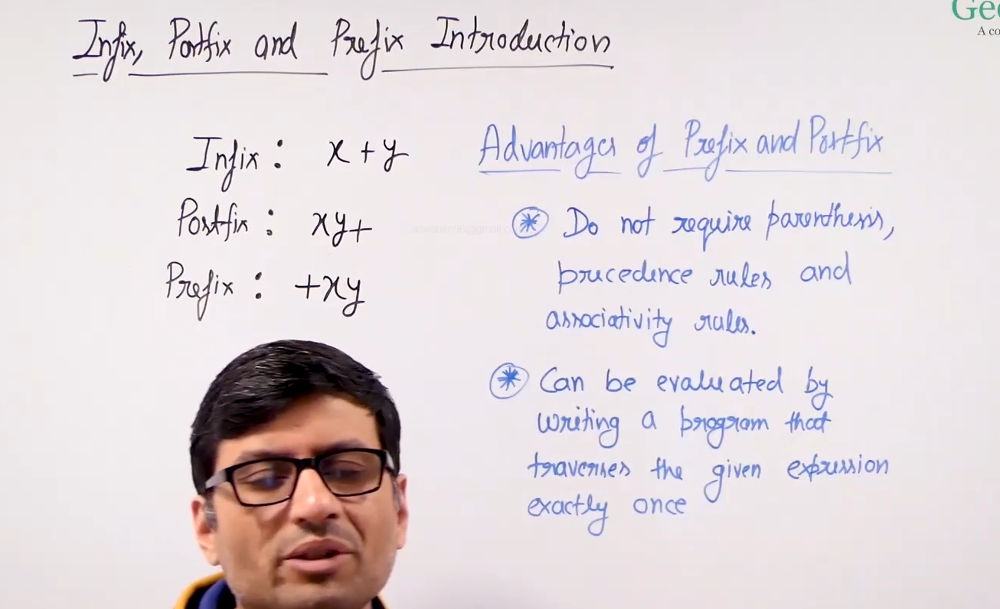
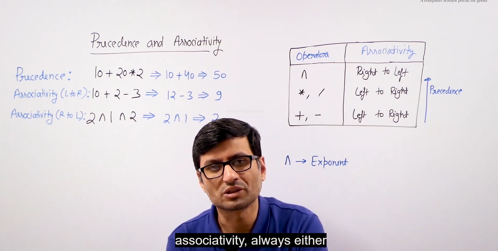
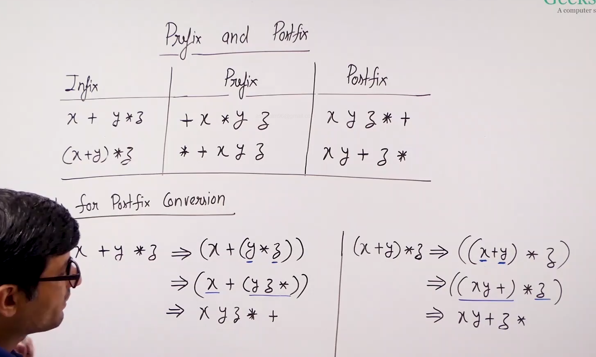

# Infix,postfix and prefix:

* 

* Infix: normal mathematical notation.

* Postfix : operator comes after the operands.

* Prefix : operator comes before the operands.

* 

* Prefix and postfix expressions dont need brackets, they dont need precedence and associavity rules. And they are evaluated by single traversal.

* But for conversion we need brackets, precedence and associativity rules.

* 