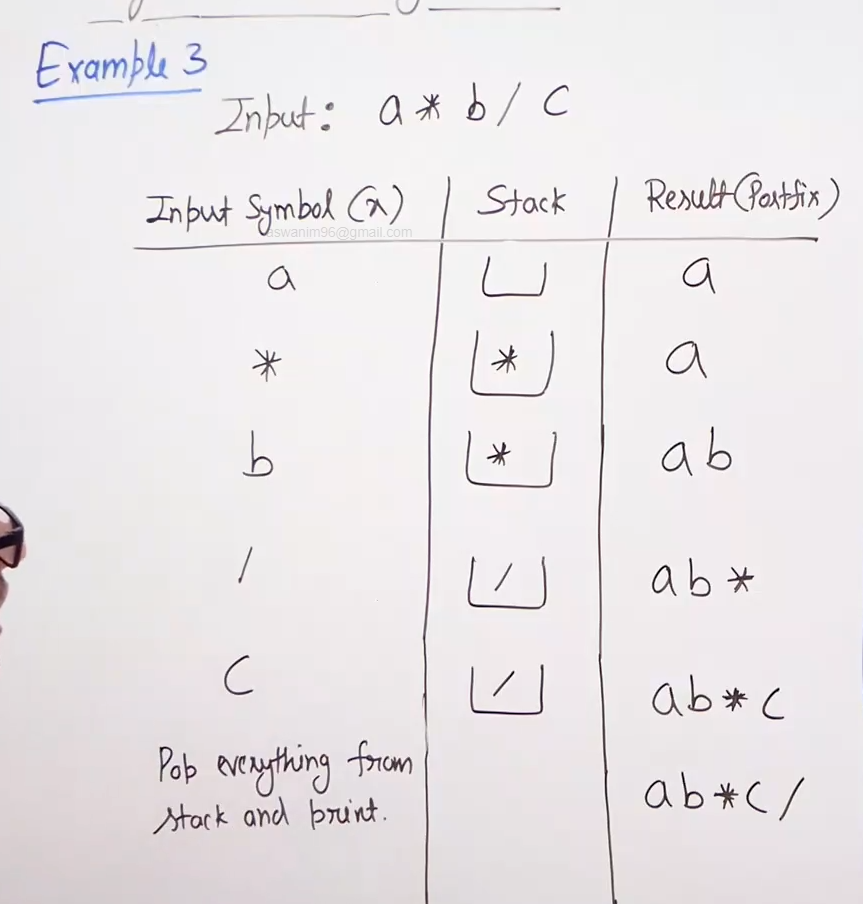

# Infix to postfix conversion :

* We consider the following rules which converting : 

* 

## Naive approach :

* A naive approach is to convert the infix expression to postfix expression is to first paranethesise the expression and then convert the inner most expressions in postfix and then the outer expressions.

* Examples:  

## Efficeint approach :

* Left paranethesis has the lowest precendence.

* Algorithm : 

* When the precendence is same we consider the associativity. So if the associativity is L to R then current element is considered lower precedence, if its R to L then current element is considered higher precedence.

* Examples :    

* Time complexity : O(n) (since we traverse the infex expression only once and also push and pop is O(1) time operations).