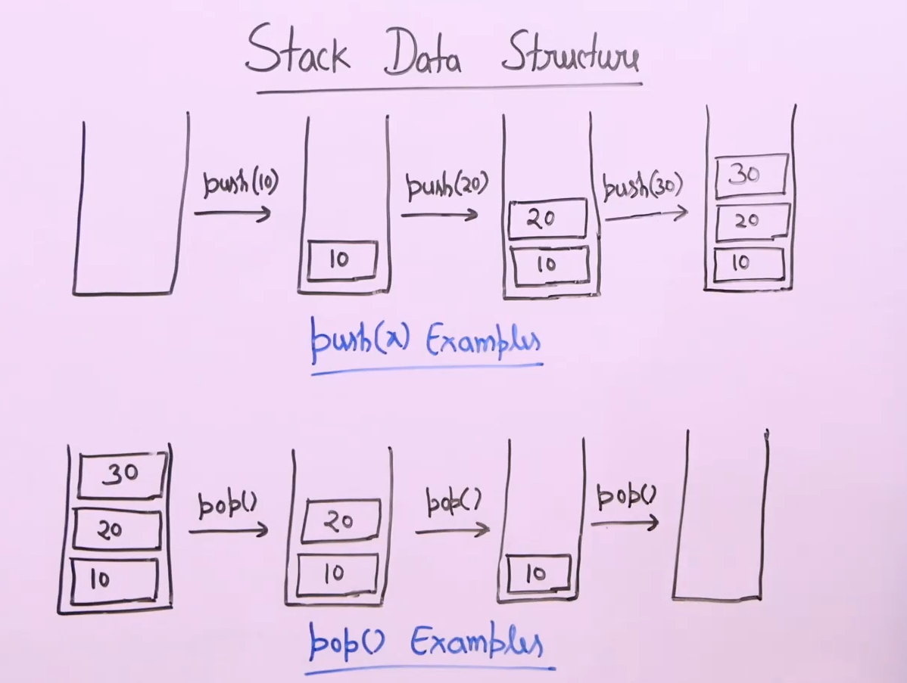
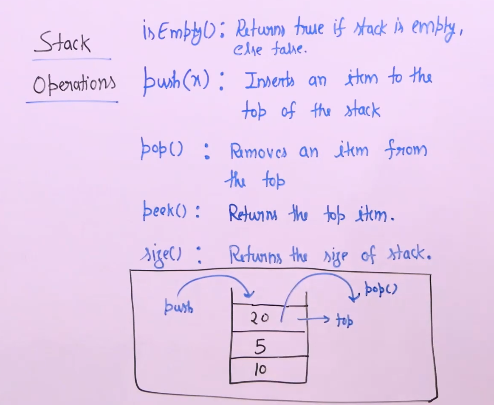

# Stack :

* Linear data structure and it works like a box which is closed from one end and we can only insert items to it from one end.

* Insertion called push and removal called pop.

* Pop removes from the top end of the stack.

* 

## Stack operation :

* 

* Only push and pop modify the stack.

* CPP has default stack container in STL.

* In CPP the operations are denoted by the following functions :
    * peek -> top
    * pop -> pop
    * push -> push
    * isEmpty -> empty
    * size -> size

* Corner conditions on stack :
    * Underflow : pop() or peek() on empty stack. CPP leads to undefined behaviour.

    * Overflow : push() on full stack. Overflow doesn't happen in container classes since it uses dynamic sized arrays for implementation.

    

