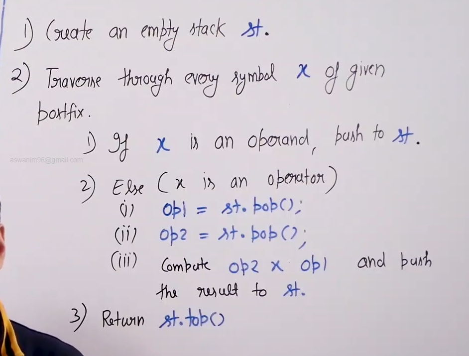
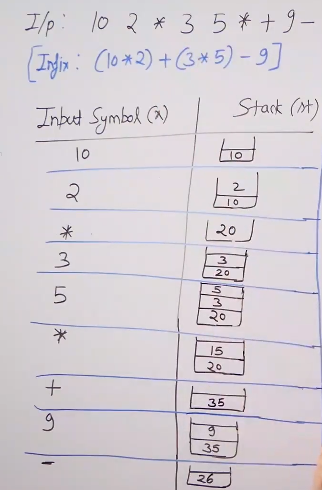
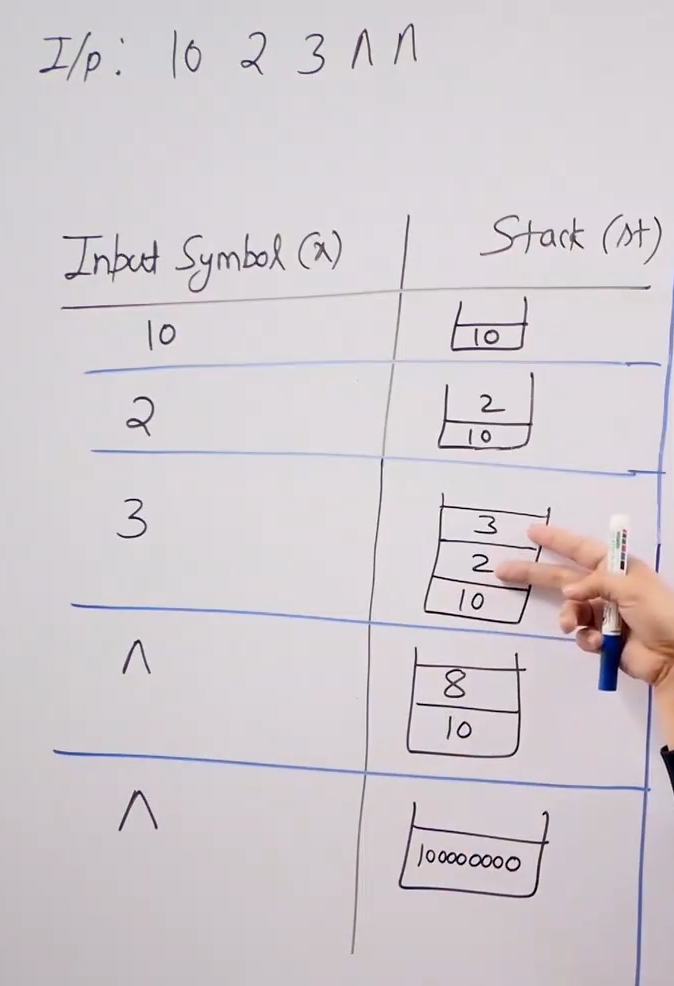

# Evaluating postfix expressions :

* Algorithms : * Idea to evaluate postfix expression is to simply apply a operator on the last two operands.

* To implement this we use the following algorithm :  

* Examples :  

* Time complexity : O(n) (1 traversal , no use of precedence , associativity and paranthesis).

* In infix to postfix we maintain a stack of operators in postfix evaluation we maintain a stack of operands.