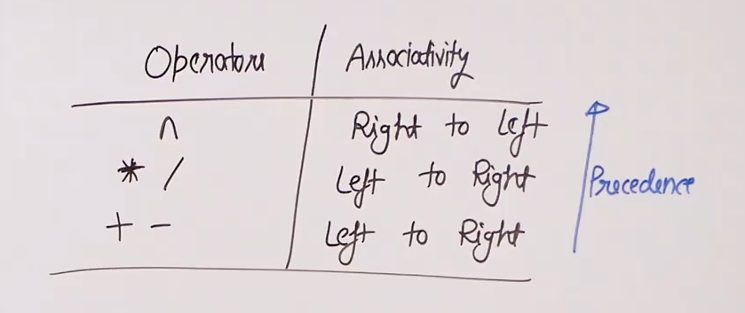
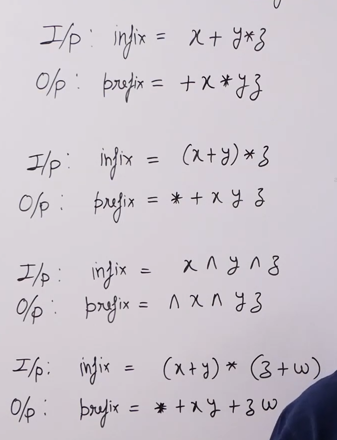
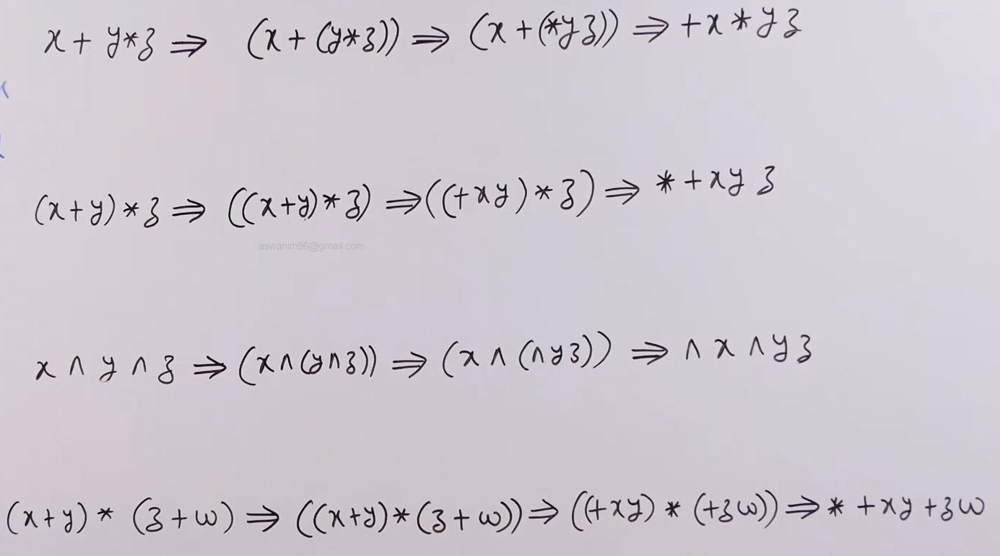
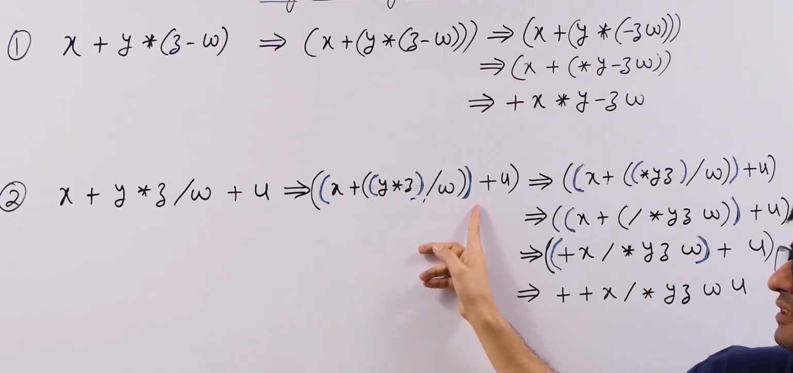
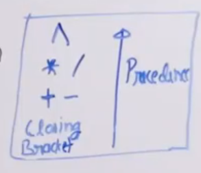
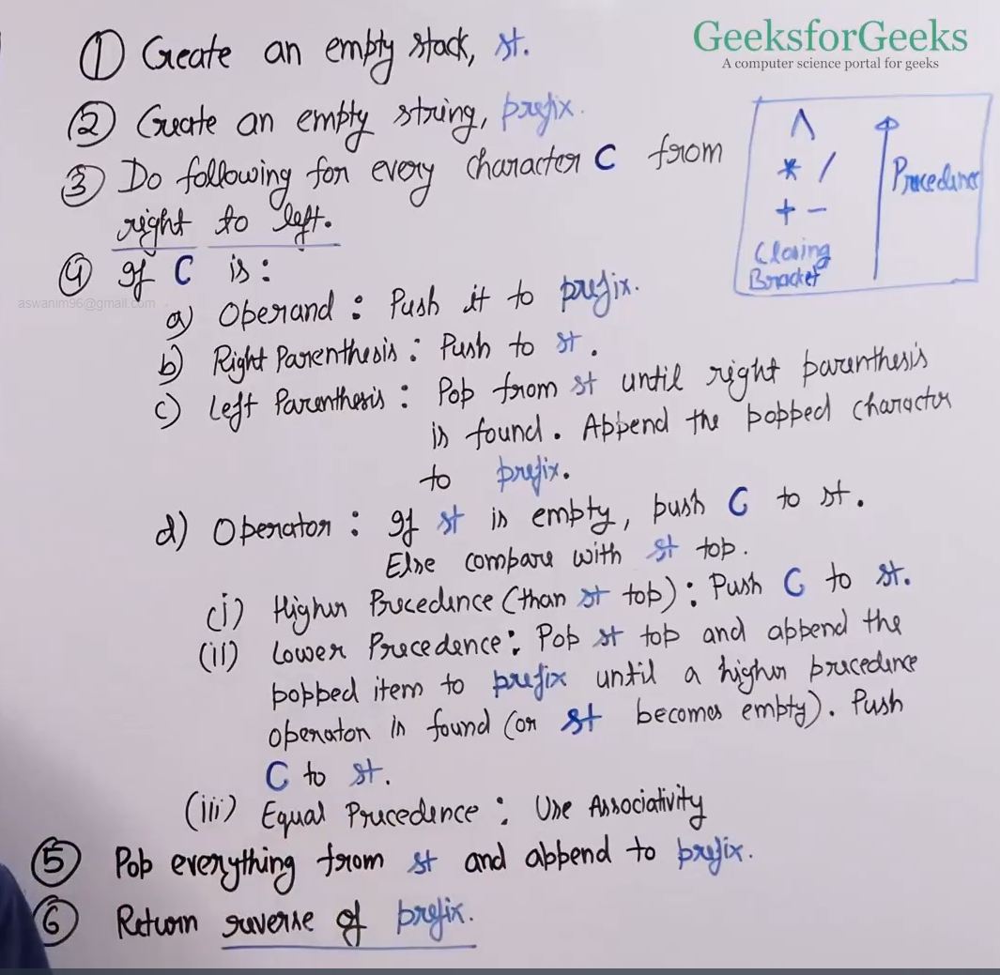
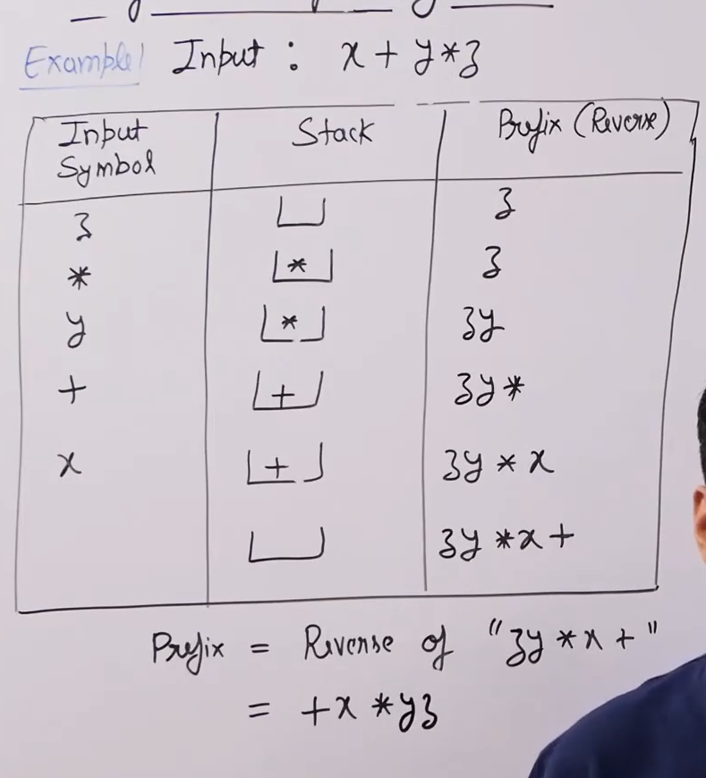
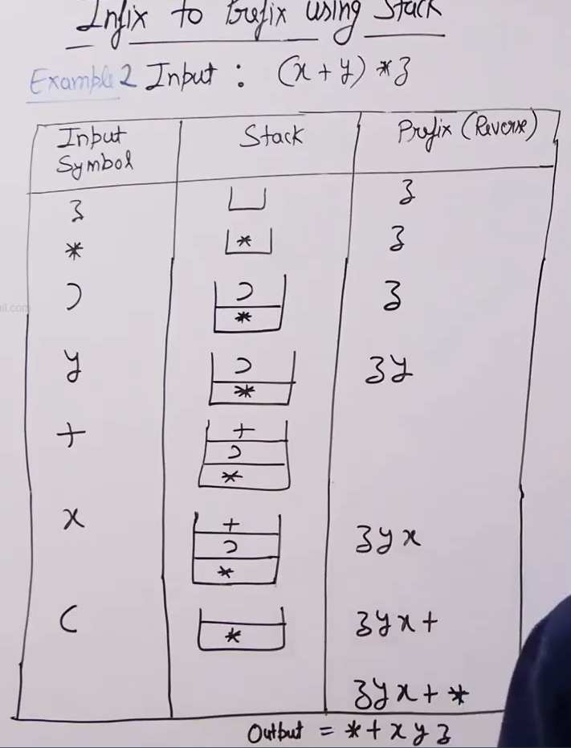
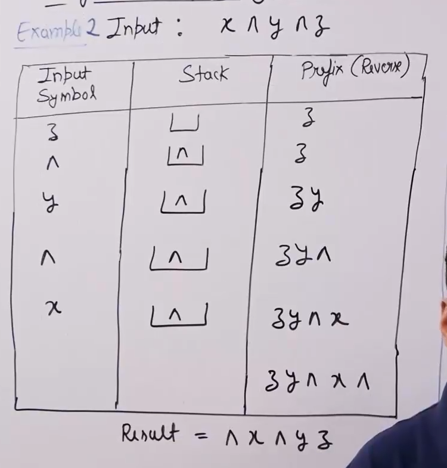
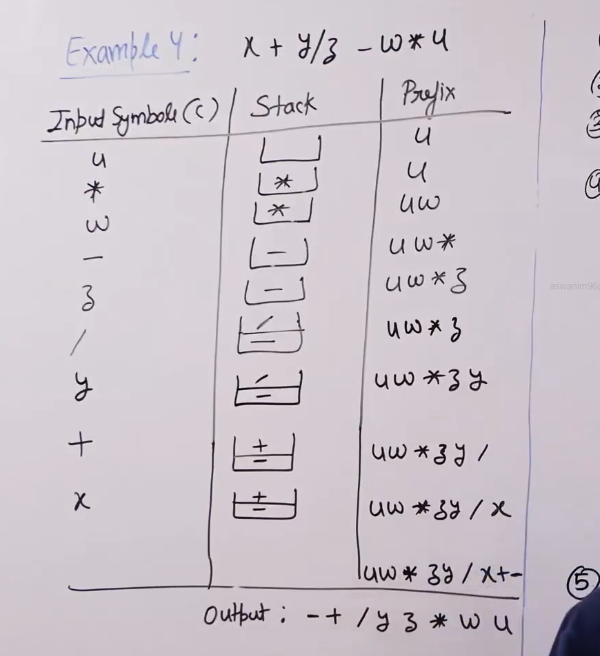

# Infix to prefix conversion :

* We consider the following rules which converting : 

* 

## Naive approach :

* A naive approach is to convert the infix expression to prefix expression is to first paranethesise the expression based on associavity, precedence and paranthesis and then convert the inner most expressions to prefix and then the outer expressions.

* Examples : , 

## Efficeint approach :

* Operator precedence : 

* Algorithm : 

* When the precendence is same we consider the associativity. So if the associativity is L to R then current element is considered higher precedence (coz of reverse order), if its R to L then current element is considered lower precedence(coz of reverse order).

* Examples :    

* In the following example + and - have the same precedence and hence we use associasivity which is L to R hence the current + will be considered as having higher precendence and hence will be pushed. 

* Time ocmplexity : O(n) where n is the length of the expression.