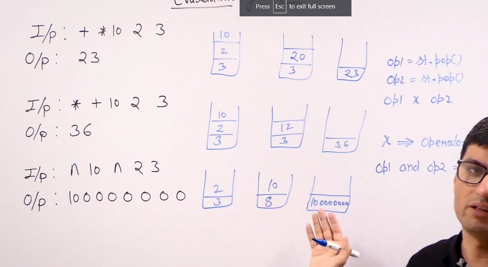

# Evaluating prefix expressions :

* Algorithms : * Idea to evaluate prefix expression is to simply apply a operator on the two operands but we traverse the expression in reverse order.

* 

* So we traverse the expression in reverse order and if we encounter a operator we consider the top two operands and apply the operator on them.