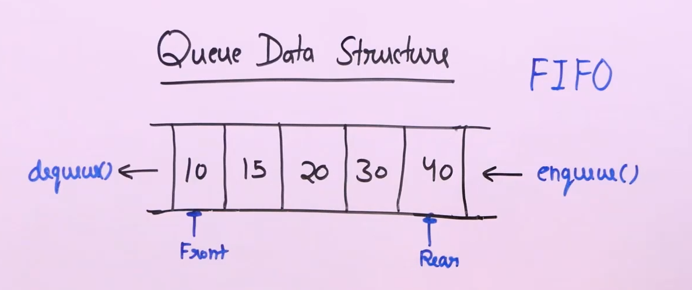
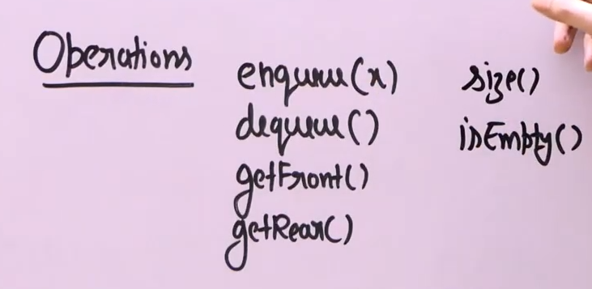
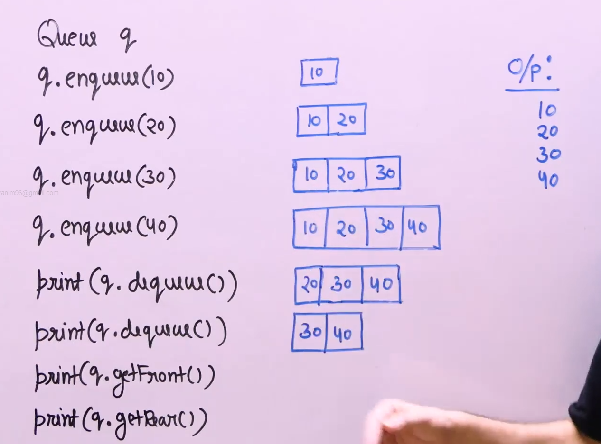

# Queue :

* 

* It is a first in first out data structure.

* It can be thought of as a pipe in suppy chain, we try to push items from the one end of the pipe and pull items from the other end.

* Operations : 

* Enqueue : adding items to the rear.

* Dequeue : removing items from the front.

* getFront : to get the front item.

* getRear : to get the rear item.

* size : to get the size of the queue.

* isEmpty : to check if the queue is empty.

* Example :  

* Front changes when we dequeue an item and rear changes when we enqueue an item.

