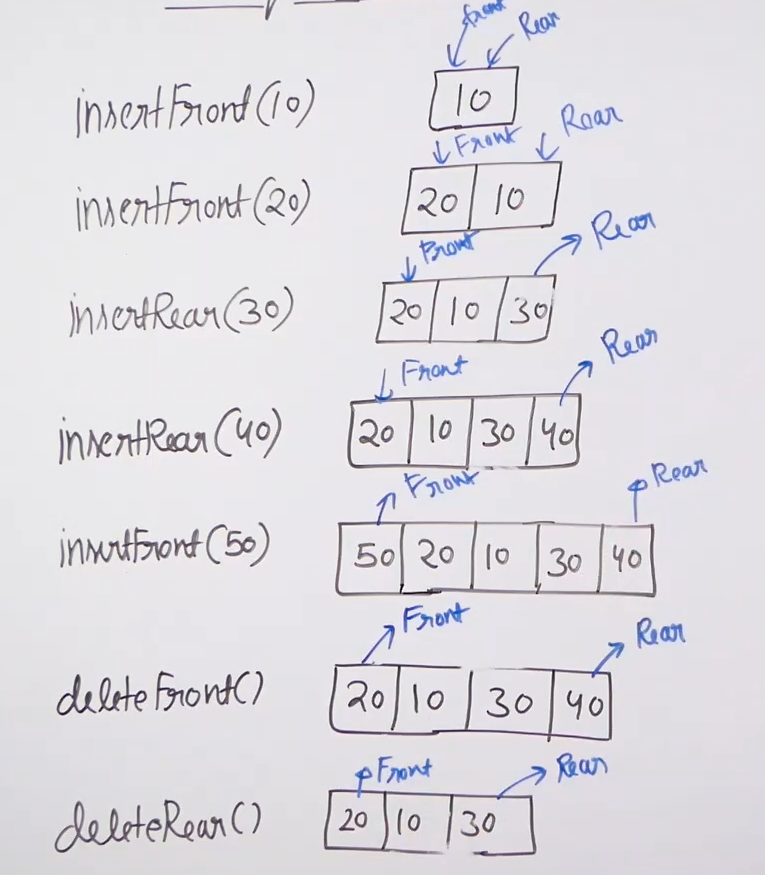
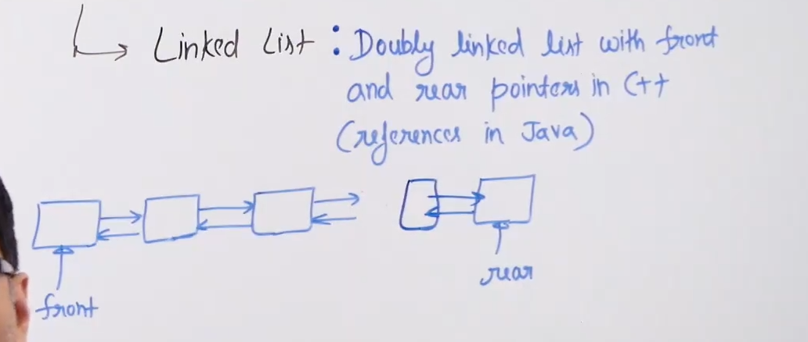
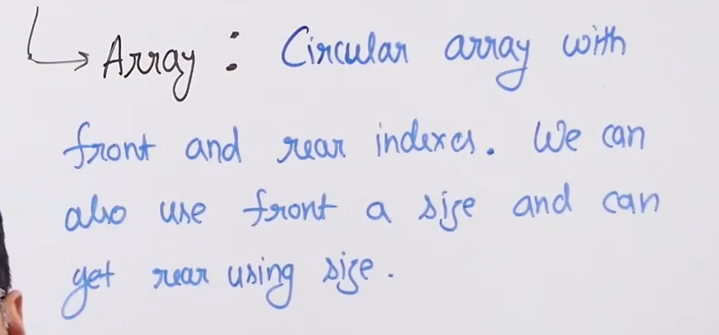

# Deque :

* Deque is a double ended queue.

* Four main operations that we do on a deque :
    * Insert front
    * Delete front
    * Insert rear
    * Delete rear

* Some addition operations :
    * Get front
    * Get rear
    * Get size
    * Is empty
    * Is full

* Example : 

* Can be implemented using : 
    * Linked List 
    * Array 

* Implementation of Deque using Linked List :
    * We use doubly linked list since we cannot delete the tail in singly linked list in O(1).
    * 

* Implementation of Deque using Array :
    * 

* Time complexity of all the deque operations in both array and linked list implementation is O(1).

* Applications of deque :
    * Can be used as both stack and queue.
    * Maintaining history of actions.
    * A steal process scheduling algorithms: 
        * This is used when we have mutiple processors and these processors have their own queues. 
        * If a proccessor pick a job from its own queue then we simply need a queue.
        * But if another processor is free and wants to pick a job from another processors queue then it picks from the rear of that processor.
        * And normal queue doesn't allow picking from the rear so we need a deque in this case.
    * Implementing a priority queue with two types of priorities. So all the elements with higher priority need to be looked after before the ones with lower priority. So we push all the element with higher priority in the front and ones with lower priority in the rear. And we always pop from the front.
    * Maximum and minimum of all subarrays of size k in a given array.
