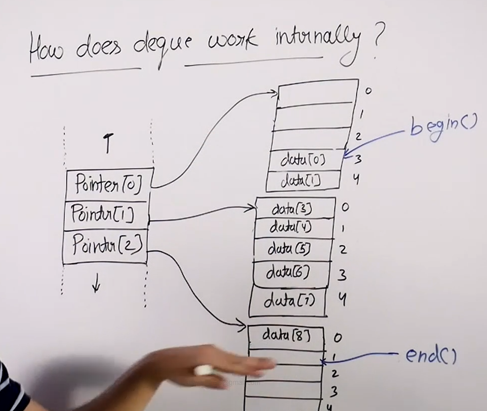

# Deque in STL :

## Internal working :

* push and pop from front and back are possible in O(1) time in deque.

* All these functions are possible in O(1) time in doubly linked list but doubly linked list does not provide random access and deque in cpp do expect random array.

* So we can use circular array which provided all the push and pop operation in O(1) and also provides random access but the issue with circular array is that once the size of deque exceeds the capacity we will need to double the size of the array and will need to copy all the data. And so if our data is an complex object this operation will take a lot of time.

* Hence deque uses a tricky implementation of arrays.

* It has an array of pointers which are used to store the references to a block of array elements. These arrays contain a fix number of elements. 

* The array corresponding to begin grows in the opposite direction (4->3->2->1..) whereas the rest of the arrays grow in the same direction (1->2->3->4..).

* In case our pointer array becomes full we just double the size of the array. And this doubling doesnot involve copying the whole data , it only involves copying the pointers. Hence its almost constant time operation.

* And for large size of pointer array we rarely see a doubling since every block of pointer array points a big chunk of data items.

* This operation has the following time complexity : 
    * push_back : O(1)
    * push_front : O(1) (we can argue that it is O(1) amortized but the number of copy constructor calls is constant).
    * pop_front : O(1)
    * pop_back : O(1)
    * random access : O(1) (since elements are stored in an array).
    * insert : O(n)
    * erase : O(n) (since its an contigous memory setup and hence insertion and deletion requires O(n) time since we need to move items).
