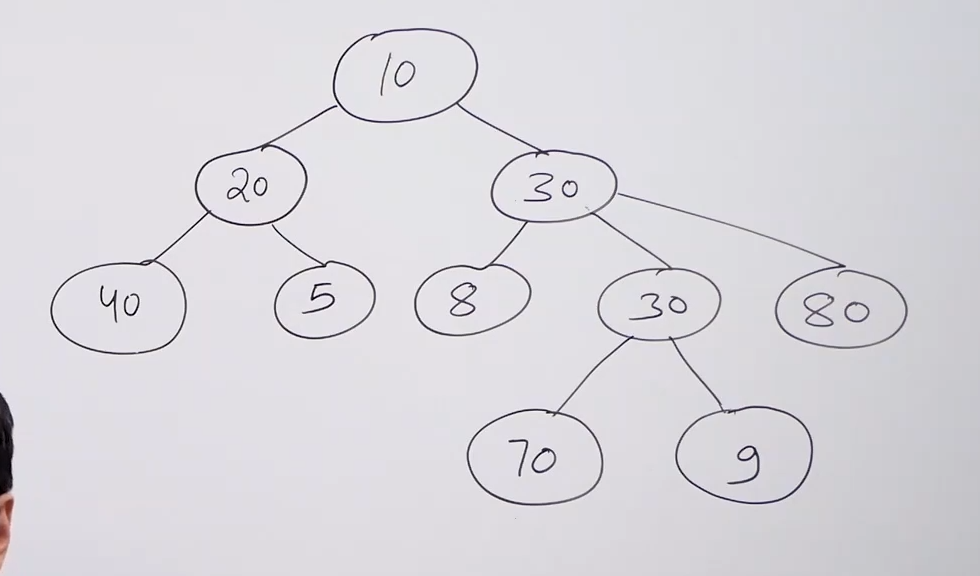

# Tree data structure :

* Used to represent hierarchical data.

* 

* All the data structures we have studied till now were linear data structures. Tree is a non-linear data structure.

* All the previous data structure stored the data in sequential manner. Tree stores the data in heirarchical manner.

* All the elements of trees are called node.

* Top node is called root node.

* Node with no child is called leaf node.

* Node which is just below a node is called child node.

* Node which is just above a node is called parent node.

* Tree data structure is recursive in nature since a tree contains multiple trees within itself called sub-trees.

* Descendants of a node are all the nodes which lie in a sub-tree with that node as root.

* Degree of a node is the number of children it has.

* All the leaf nodes have degree 0.

* All the non-leaf nodes are called internal nodes.

