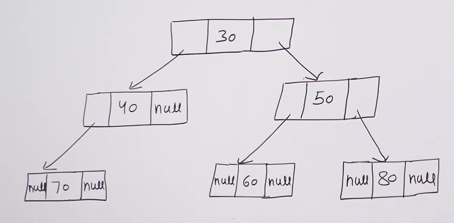

# Binary tree :

* Every node has at most 2 children. So degree of any node is atmost 2. So it can be 0,1 or 2.

* Actual representation of binary tree : 

* Every node has 3 fields :
    * data
    * left child (left pointer)
    * right child (right pointer)

* For leaf nodes, left and right pointers are NULL.

* This is the most common representation (linked representation) of tree data structure. But we can represent it using an array. Some trees like binary heap , segment tree are represented using arrays.

* We study binary tree and not generally n-ary tree becuase the most popular tree data structure which are used a lot are based on binary tree.

* Binary search tree is the most used tree data structure and binary heap is another popular tree data structure (used for priority queues) both of them are binary tree data structure.

* Segment tree data structure which is used for query searches is a binary tree data structure.

