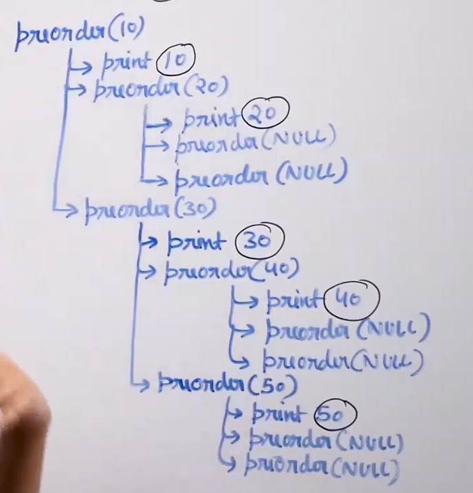

# Tree traversal :

* We need to print every key exactly once.

* Traversal of a tree is requirred for many operations.

* Tree traversal can be broadly divided into two types:
    * Breadth first (level order from top to bottom)
    * Depth first (we go to one side traverse it completely and then go to the other side)

* Depth first traversal can considered doing three tasks :
    * Process the root node
    * Process the left subtree
    * Process the right subtree

* Process the  left and right subtree can be seen as a recursive task.

* There can be many ways to do these 3 tasks . Out of all permutation 3 permutations are most popular : 
    * Inorder traversal
    * Preorder traversal
    * Postorder traversal

* In all these traversal we visit the left subtree before the right subtree.

* Inorder traversal : left subtree, root, right subtree

* Preorder traversal : root, left subtree, right subtree

* Postorder traversal : left subtree, right subtree, root

## Inorder traversal : 

## Preorder traversal : 

## Postorder traversal : 
