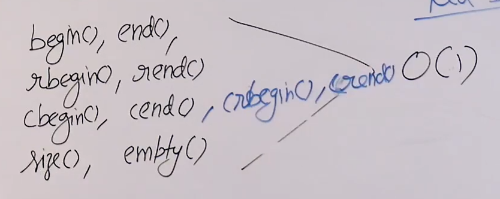
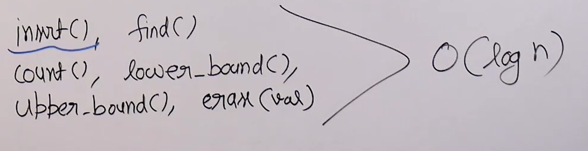
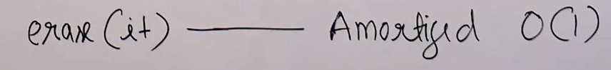

# Set in STL:

* Set is based on self-balancing BST and in particular red-black-tree.

* Height of red-black-tree is O(log n).

* So time complexity of search,insert and delete is O(logn). And if traverse a tree inorder fashion we get elements in sorted order.

* Itterators : 

* Operations (find,count,lower_bound,upper_bound are search functions) : 

* Erase with itterators : 

## Applications of set:

* Sorted stream of data.

* Doubly ended priority queue. (We can max and min using s.begin() and s.end() using a set DS).

