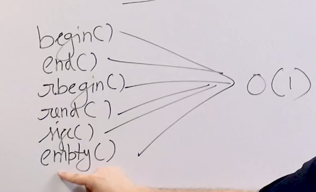
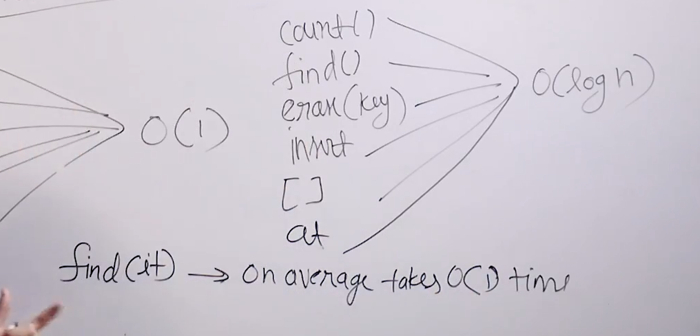

# Map in STL:

* Is also built using red-black tree but item is a pair.

* Items are ordered according to keys.

## Time complexity :

* 

* 

## Applications of maps :

* Sorted stream of data with (key, value) pairs.

* Doubly ended priority queues with (key,value) pair.