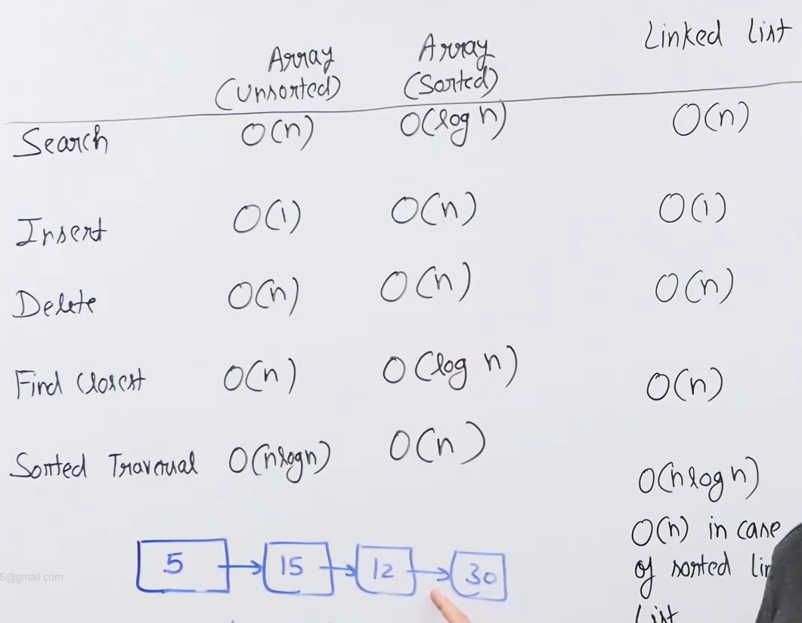
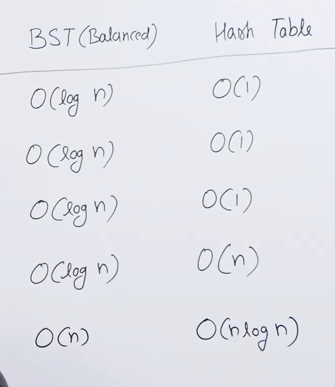
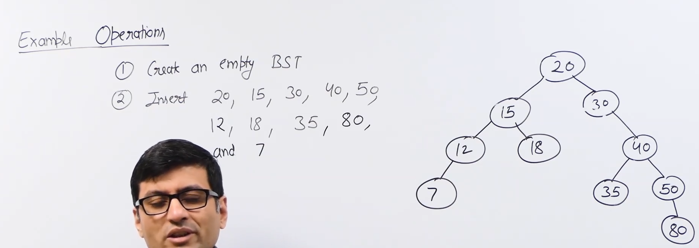
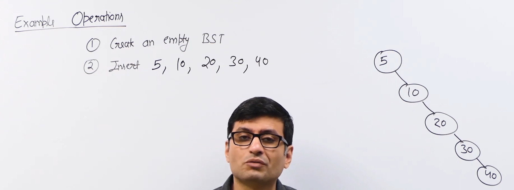
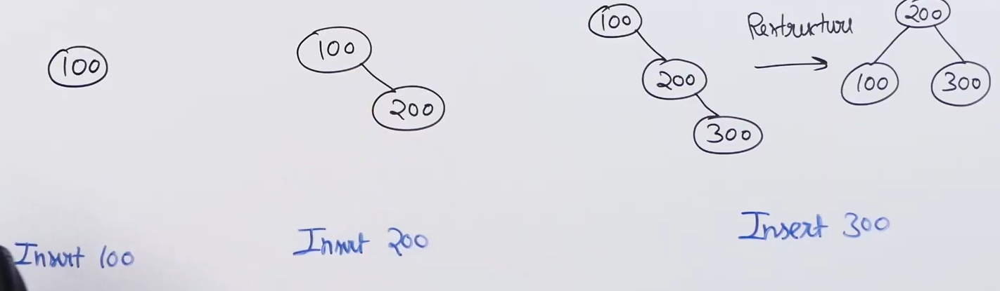
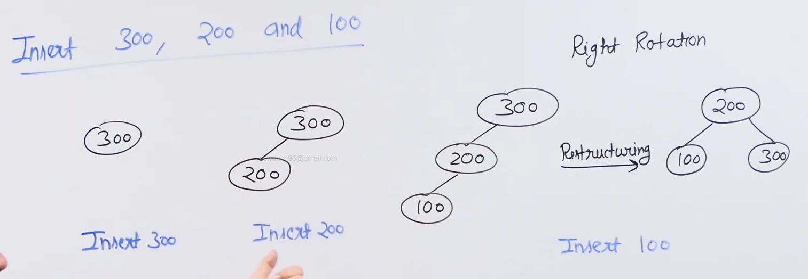
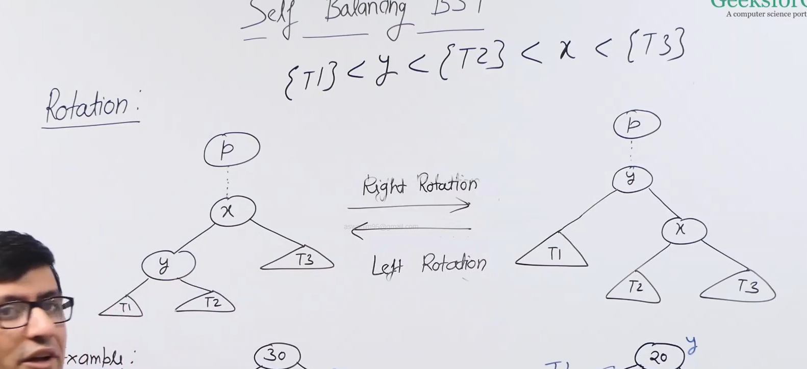
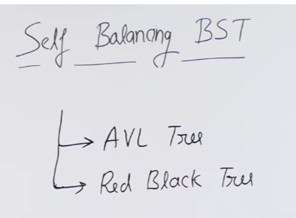

# Binary search tree: 

* This is data structure which is used for most efficient implementation of search, insert, delete , find closest element and sorted traversal.

* A balanced binary search has time complexity O(logn) for search ,insert, delete, find closest. Also it has O(n) for sorted traversal.

* These values are only for a balanced BST , if the tree is unbalanced then the time complexity will be the height of BST.

* 

* 

## Theory :

* Binary search tree is setup in such a way that when we are searching an item we can almost skip half of the items.

* Idea is based on binary search algorithm.

* For every node, keys in left side are smaller and keys in right side are greater.

* All keys are typically considered as distant.

* Like linked list, it is a linked data structure. So we have no memory limit and can insert as many elements as we want but the disadvantage is that it is not cache friendly.

* Implemented in C++ as map,set,multimap,multiset (in particular self-balancing BST).And in java as treeset and treemap.

* 

* 

* Most of the operations of BST like search,insert,delete and finding the closest are O(h).

## Search in BST:

* Need to return boolean for key with the root of a BST given.

* We compare the value to be searched with the value of the node and move left or right accordingly.

* If we hit a null node, then we return false.

## Insert in BST:

* If the node is not present in the BST we insert it at the leaf.

* If the tree is null the inserted value becomes the root.

* If the node is present then we don't do anything.

## Delete in BST:

* When we delete a key from the BST we need to make sure that the rest of the BST still follows the properties of a BST.

* There are three cases of deletion:
    1) If the node is a leaf node.
    2) If the node has only one child.
    3) If the node has two children.

* If the node is a leaf node, we just delete it.

* If the node has only one child, we replace the node with its child.

* If the node has two children, we find the closest greatest value or the closest smallest value and replace it with that.

* Closest greatest value is the inorder successor since it appear next in the inorder traversal (inorder traversal of a BST is sorted ). And the inorder successor is the left most child of the right child.

* Closest smallest value is the inorder predecessor since it appear next in the inorder traversal. And the inorder predecessor is the right most child of the left child.

* If key doesn't exist in the BST we do not delete it.

## Floor in BST :

* Floor will be value closest to the key but less than the key. And if there is no value which is less than the key then it will return NULL.

* We simply perform BST search and if the key is less than the given key we make it as the floorNode and keep on searching in its right node.
 
* If the curr node is bigger than the given key we go to its left.

* We keep on search till we reach NULL.

## Ceil in BST :

* Ceil will be value closest to the key but greater than the key. And if there is no value which is greater than the key then it will return NULL.

* Implementation is similar to floor.

## Self-balancing BST :

* Time complexity of all the above operations is O(h) where h is the height of the BST.

* So if the height of the BST becomes n then the time complexity of all the operations will be O(n).

* The idea of BST is make sure that the height of the BST never goes beyond theta log n.

* Height of a BST depends on how we insert keys in the tree. Same set of keys can make different height BST's.

* If we know the keys in advance then we can make a perfectly balanced BST with the given keys.

* But we need to keep it balanced with random insertion and deletion.

* Idea is to do some restructing (or re-balancing) of the tree when we insert or delete a key.

* 

* This restructing is called rotation. And we are doing left rotation in the above tree.

* Example of right rotation : 

* The main idea that self-balancing BST's use is rotation. We can restructing the tree without violating the BST property.

* And rotation is O(1) operation.

* Rotation : 

* And in the above rotation we follow all the properties of BST.

* 

* We discuss the implementation in above trees.

* AVL is very strict about the balance in the tree. 

* Red-black tree is not strict about the balance. In generally red black tree is used more.