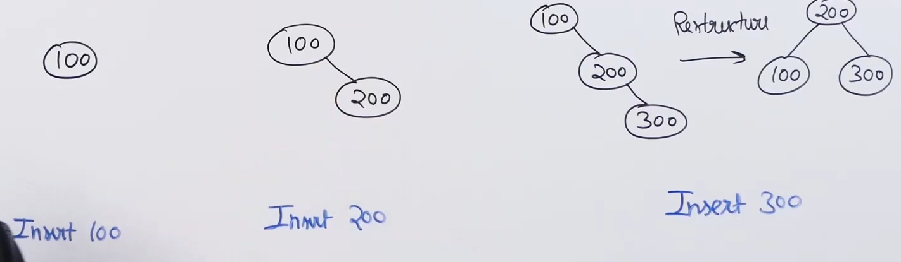

# AVL tree :

* It is a BST (for every node,left subtree is smaller and right greater).

* It is balanced (for every node,the difference between the height of left and right subtree is atmost 1).

* Balance factor = [height of left subtree] - [height of right subtree]

* For self balancing tree, balance factor of every node <=1.

* 

* Search in AVL tree is same as a normal BST. Insert and delete are different from a normal BST becuase in these operations we need to make sure that height is balanced.

* AVL tree does rotation to make sure that the tree is balanced.

## Insertion in AVL tree:

* Perform normal BST insert.

* Traverse all ancestors of the newly inserted node from node to root.

* If find an unbalanced node, check for any of the below cases:
    1) Left Left      ------
                           |-> Single rotation 
    2) Right Right    ------

    3) Left Right     ------
                           |-> Double rotation
    4) Right Left     ------

* Example of left left case : 

* For left left case we do a right rotation.

* Example of right right case : 

* For right right case we do a left rotation.

* Example right left case : 

* For right left case we do a right rotation about the bottom node to make it a right right case and then we do a left rotation about the top node.

* For left right case we do a left rotation about the bottom node to make it a left left case and then we do a right rotation about the top node.

* In case of AVL tree insertion when we fix an unbalanced node, we fix the whole tree.

* In case of AVL tree delete when we fix an unbalanced node, we still need to travel to the ancestor to fix other nodes.

* Time complexity : BST insert + Travelling accestors * Rotations
                  : Theta(log n) + Theta(log n) * Theta(1)
                  : Theta(log n)

* 
