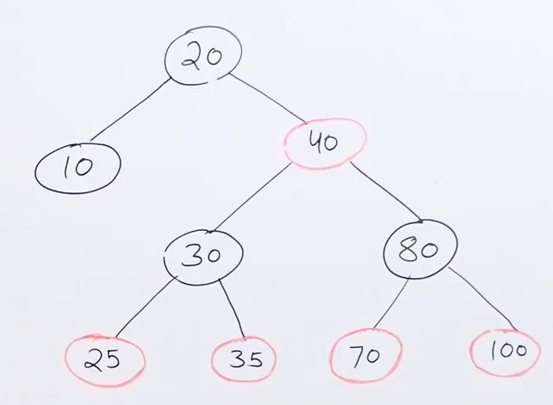
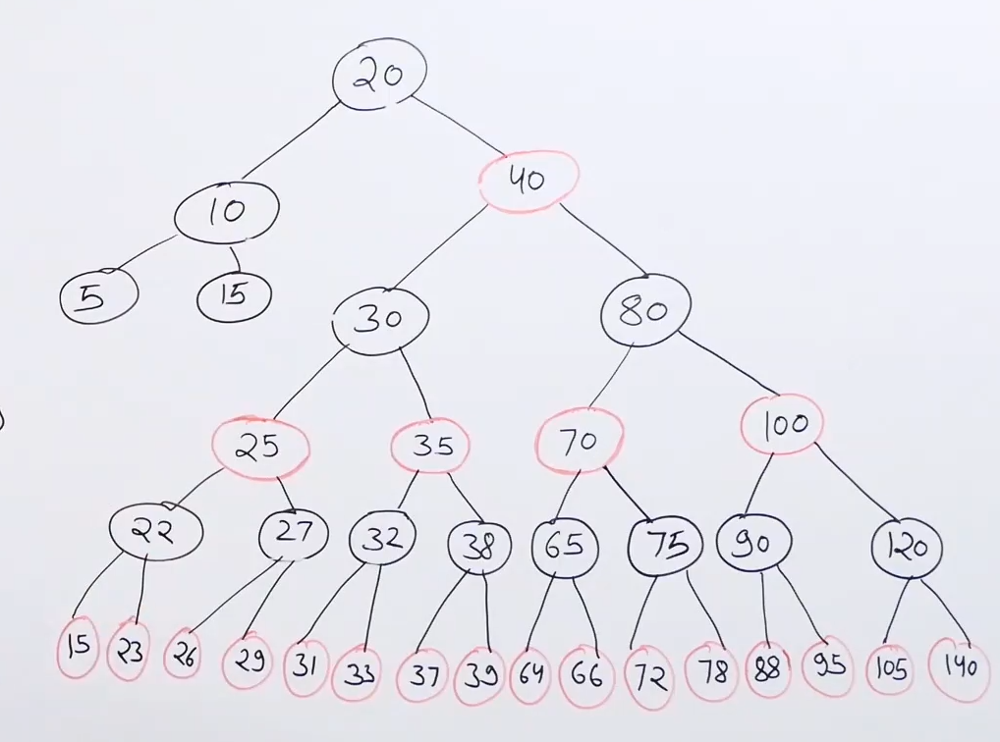

# Red black tree :

* Self balancing binary search tree with simple search and complex insert and delete.

* In insertion and delete we perform restructing if the tree is unbalanced.

* RBT is not as strict as AVl tree. And it allows upto twice the number of nodes in one subtree as compared to the other.

* Advantage of being loose is that number of rotations is less.

* Disadvantage of being loose is that height may becomes high and which will cost search being costly.

* When we need to perform more search and less insertions and deletion we use AVL tree because its height is always less.

* But in general cases of insertions, deletions and searches we use Red black tree.

## Definition:

* Every node is either red or black.

* Root is always black.

* **No two consecutive red nodes.**

* **Number of black nodes from every node to all of its descendant leaves should be same.**

* So the black height of every node to the leaves is same.

* This is maximum unbalanced RBT : 

* Another example of maximum unbalanced RBT : 

* Number of nodes on the path from a node to its farthest descendant leaf should not be more that twice than the number of nodes on the path to its closest descendant leaf.