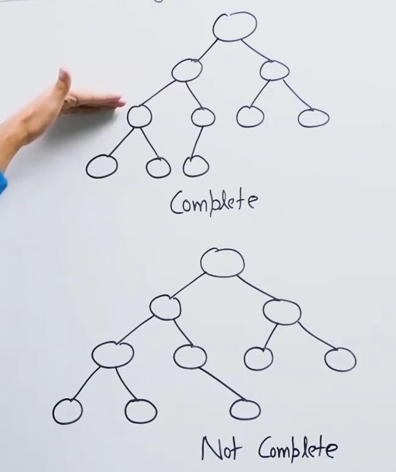
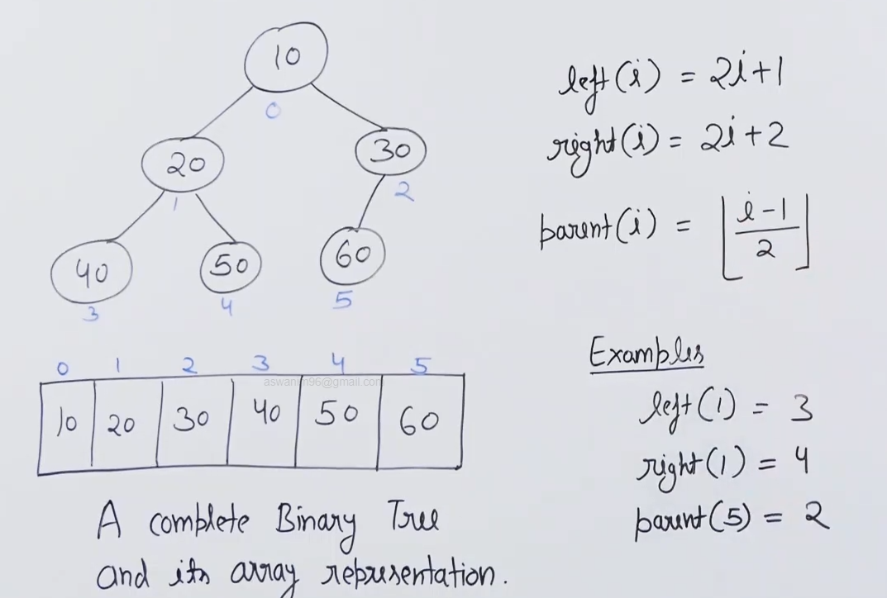
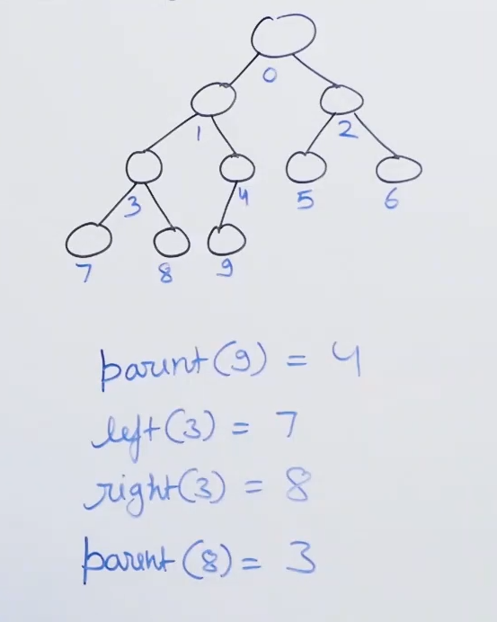
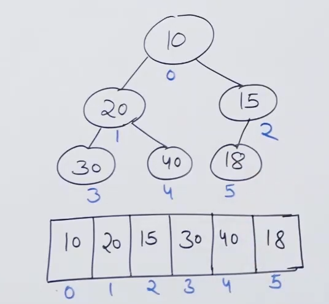

# Binary heap :

* Used in heap sort.

* Used in implementation of priority queue. This is its main use since priority queue is used in a lot of important algorithms.

* Two types : 1) Min heap (highest priority is assigned lowest value)
              2) Max heap (highest priority is assigned highest value).

* Binary heap is a complete binary tree (all the levels are filled except the last level and last level filled from left to right).

* Complete vs not complete : 

* Advantage of using complete binary tree is that we can store it as array without wasting any space with proper parent child relationship.

* 

* Left of item at i : 2*i+1

* Right of item at i : 2*i+2

* Parent of item at i : floor((i-1)/2)

* 

* Advantage of being able to store in arrays : 1) Random access
                                               2) Cache friendly
                                               3) Tree has minimum height and operation which depend on height are faster
                                               4) Using linked data structure leads to wastage of space becuase of references.

## Min-heap :

* Complete binary tree.

* Every node has value smaller than its descendants.

* Example : 

