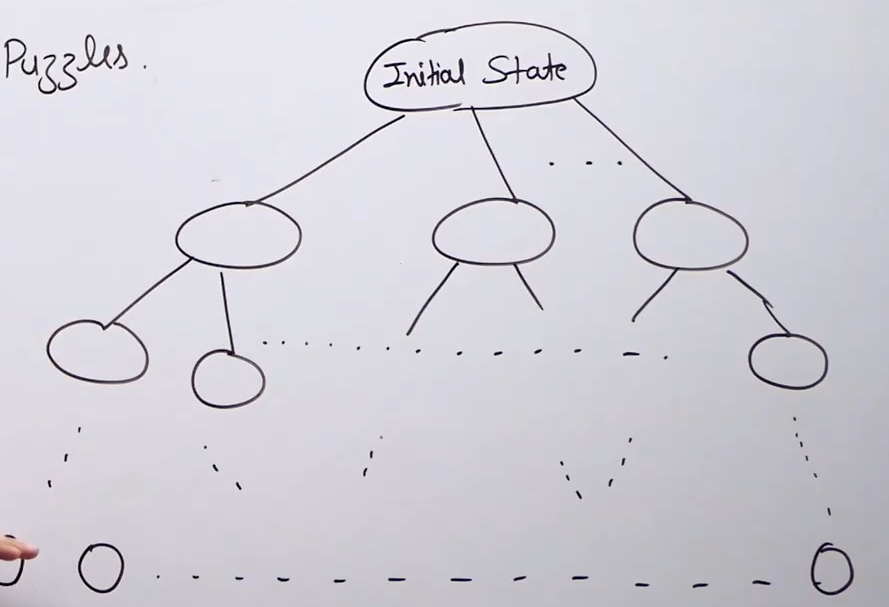

# Applications of DFS

1) Cycle detection 

2) Topological sorting 

3) Strongly connected components

4) Solving maze and similiar puzzles : in the problems like the one given below we need to find a solution stage and we do that using DFS of all the stages. (BFS will traverse all the elements in a stage leading to wastage of time)(Backtracking algos based on DFS).

    

5) Path finding : this is natural to DFS since if we go from source to destination the stack will contain all the vertices of the path but in BFS if we reach the queue may or may not contain all the vertices from the source.