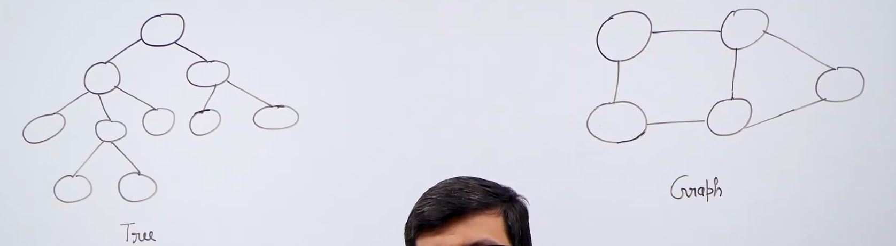
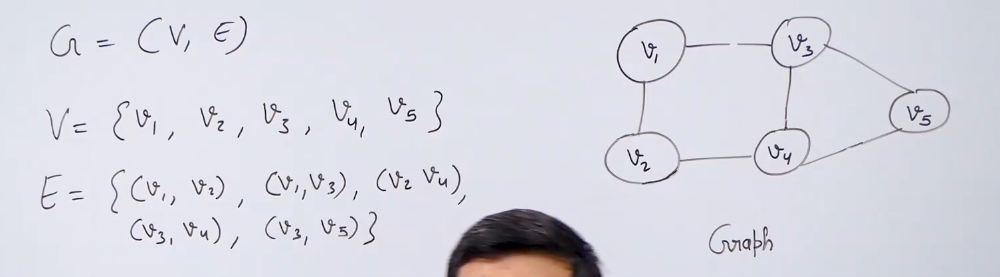
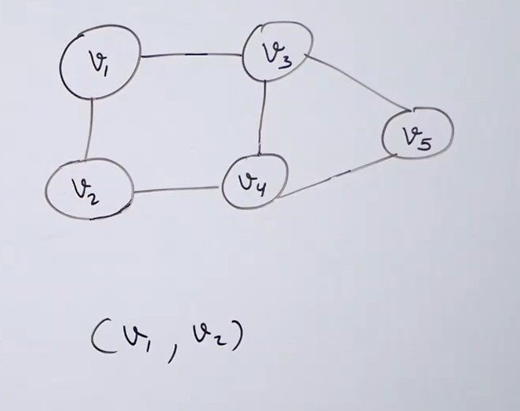
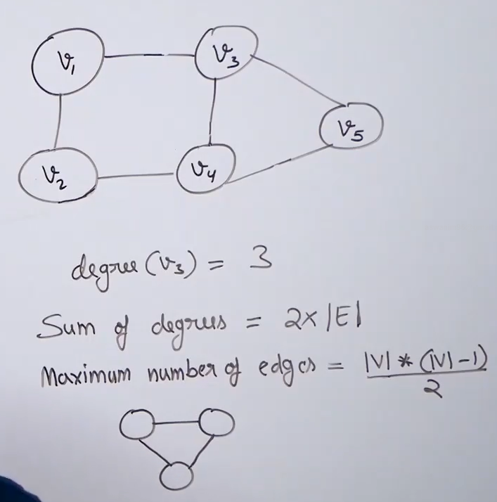
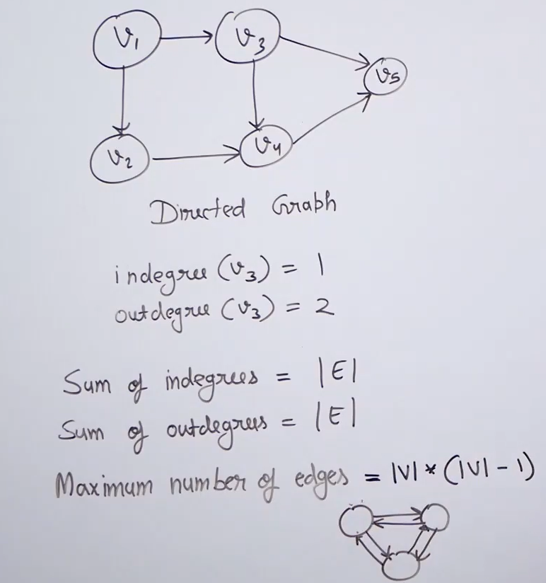
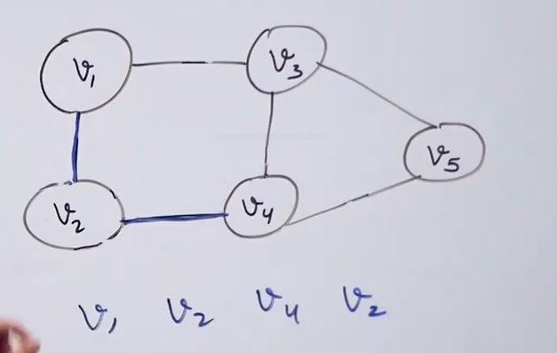
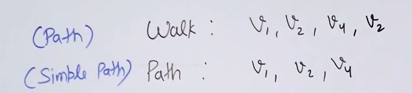
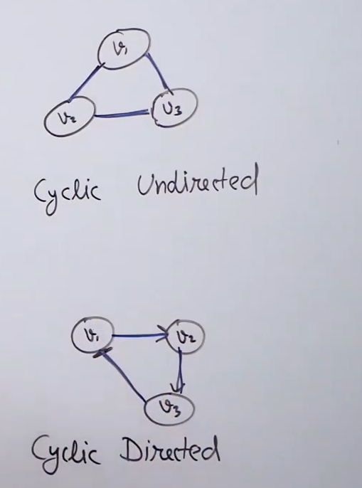
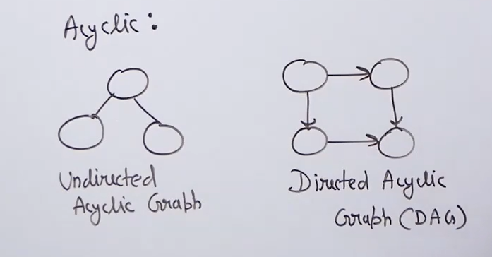
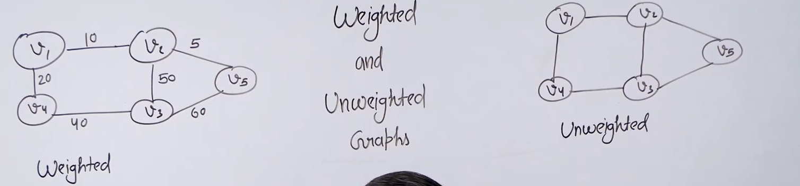

<h1><b>Graphs</b></h1>

<h2>Introduction</h2>

* The difference between trees and graph is that : trees are used to represent hierarchial relationships whereas graph are used to represent friendship relationship.

* We cannot use trees whenever we have random connection between the nodes , for this purpose we use graph data structure.

* A graph data structure is represent as a pair of set. The first set contains all the vertices and the other set is the set of edges.

<h2>Directed vs Undirected</h2>

* In undirected graph the edge (v1,v2)=(v2,v1) so the edges are unordered. Eg: Social network.

* In directed graph the edges are directed and hence if the edge is (v1,v2) we can only go from v1 to v2 and not from v2 to v1. Eg: world wide web.

<h2>Undirected graph</h2>

* Degree of a vertex is the number of edges going through it.

* Maximum number of edges = |V|*(|V|-1)/2 (In this case every |V| vertex with be connect with 1 edges to another |V|-1 vertex).And we donot consider self loop.

(Such a graph with all the undirected edges is called undirected complete graph)

<h2>Directed graph</h2>

* Indegree of a vertex is the number of edges coming to it.

* Outdegree of a vertex is the number of edges coming out of it.

* SUM(Indegree)= |Edges|

* SUM(Outdegree)= |Edges|

* This is because every indegree edge is an edge and same for an outdegree edge.

* Maximum number of edges = |V|*(|V|-1) (In this case every |V| vertex with be connect with 2 edges to another |V|-1 vertex).And we donot consider self loop.

(Such a graph with all the edges is called complete graph)

* Minimum number of edges in both graphs is 0.

<h2>Terms in graphs</h2>

* <b>Walk</b> : A sequence of vertices we get by following edges of a graph. 

* <b>Path</b> : A special type of walk with no repeatition of vertices allowed. 

* <b>Cyclic</b> : A graph is called cyclic if there exists a walk that begins and ends with same vertex .

* <b>Acyclic</b> : A graph is called acyclic if there does not exists a walk that begins and ends with same vertex .

(Directed acyclic graphs are called DAG and are very important)

* <b>Weighted</b> : A graph is called weighted if there is weight associated with each edge. Eg : Graph made up of roads connecting different cities where the weight is the length of thr roads. Another example is computer networks.

* <b>Unweighted</b> : A graph is called unweighted if there is no weight associated with each edge. 

