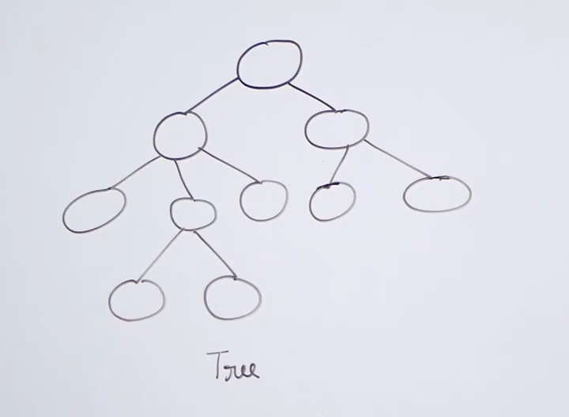
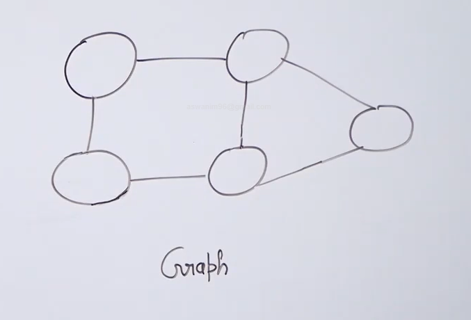

<h1><b>Graphs</b></h1>

<h2>Introduction</h2>

* The difference between trees and graph is that : trees are used to represent hierarchial relationships whereas graph are used to represent friendship relationship.

 

* We cannot use trees whenever we have random connection between the nodes , for this purpose we use graph data structure.

* A graph data structure is represent as a pair of set. The first set contains all the vertices 

