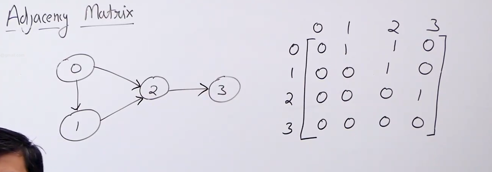

# Graph representation

* We can represent graphs in the following ways: 
    1) Adjacency matrix

    2) Adjacency list

## Adjacency matrix

* We represent the graph as a matrix of V*V.

* The value at mat[i][j]=1 if there is an edge from i to j.

* For undirected graph this matrix is always symmetrix because for (i,j) (j,i) also exists.

* For directed graph this matrix may or may not be symmetric.

* To handle vertex names with string values we use a string array with the index corresponding that string as the value given to that string. Also since we might need to find the integer value associated with a string so we create another hash table (which acts like reverse hash) to store the index associated with each string.

## Properties of adjacency matrix representation

* Space requirred : O( V X V)

* Time complexity of different operations :
    1) Check if u and v are adjacent : Theta(1) (coz we only need to find the value of matrix at (u,v)).

    2) Find all the vertices adjacent to u : Theta (V) (coz we need to traverse the row u).

    3) Find degree of u : Theta(V).

    4) Add/Remove a edge : Theta(1) (we just need to mark the corresponding points in the matrix as one).

    5) Add/Remove a vertex : Theta(VXV) (because we need to allocate or deallocate space and mark all the vertices associated with the new vertex and that take V^2 time)

    