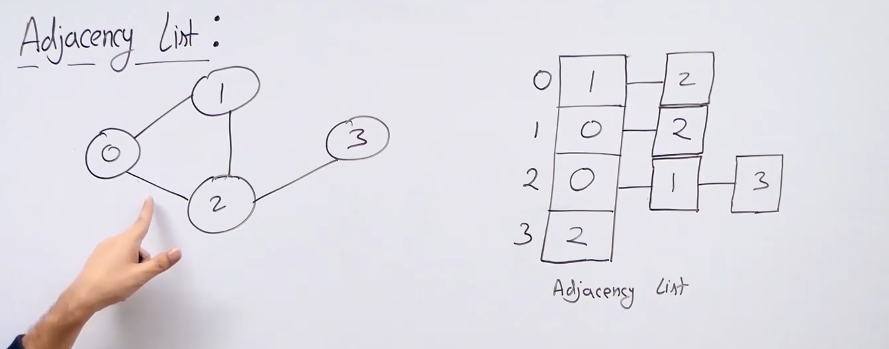
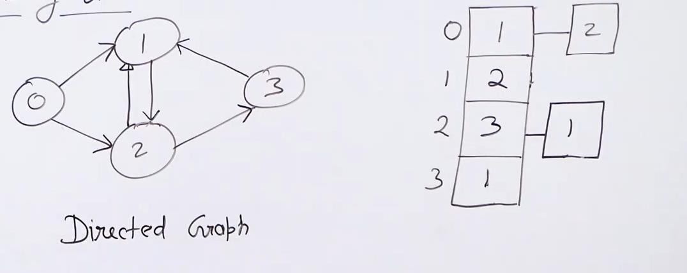

# Adjacency List:

* We use adjacency list to implement graph because adjacency matrix is redundant and takes space for values which are adjacent to it and also those which aren't.

* On the other hand adjacency list only stores the vertices connected to another vertex: 

* Adjacency list also makes the operation to find the vertices adjacent to one vertex easier.

* To store an undirected graph in an adjacency list we add the other vertex to the list of both the vertices in the pair.

* To implement a adjacency list we use an array of lists. These lists can be :
    * Dynamic sized array : 
        * Advantages : cache friendly , easy impl.
        
        * Disadvantages : wastage of space , addition can become O(n) due to increase in the size of array.
    * Linked list

* For directed graph we only store the outgoing edges for each vertex :

## Properties of adjacency list representation

* Space requirred : O( V + E )
(For undirected it requirres : V + 2*E space exactly as each edge is stored twice for undirected)

* Time complexity of different operations :
    1) Check if u and v are adjacent : Theta(V) we go to u's dynammic array and search for v

    2) Find all the vertices adjacent to u : Theta (degree(U)) (coz we only traverse the connected edges).

    3) Find degree of u : Theta(1).

    4) Add an edge : Theta(1) (we just need to a element in the dynamic array of both vertices). (In dynamic array its on avg O(1) for linked list its always O(1))

    5) Remove an element : O(V) (V for searching)
