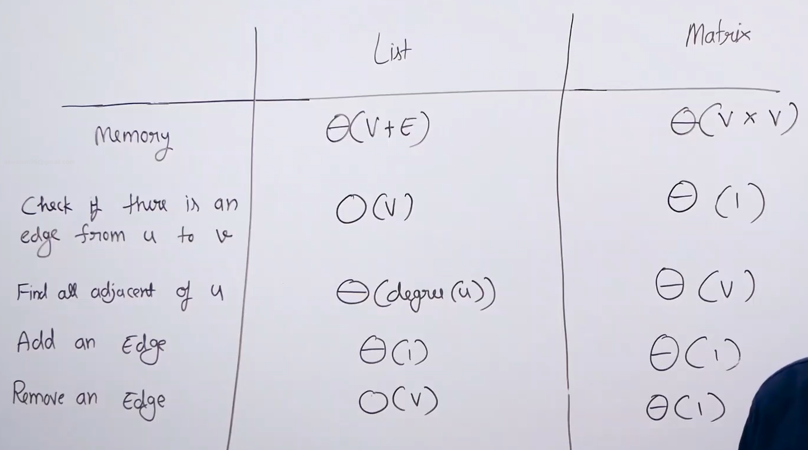
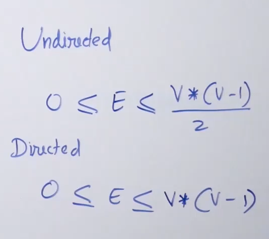

# Comparision between adjacency list and adjacency matrix :

## Main points : 

* Adj list requirres theta(V+E) space but adj matrix requirres theta(V^2) space and this is a huge advantage of adj list. The following image shows the range of edges of directed and undirected graph. 

   

* In the worst case adjacency list also requirres O(V^2) but majority of real life graphs have less edges and are called **Sparce Graphs**. And the graph with edges closer to the upper limit of edges are called **Dense Graphs**. Since in real life majority of graphs are sparce (Eg : social network where out a billion ppl we only have 500 freinds) hence adjacency lists requirred alot less space compared to adjacency matrices.

* Adjacency matrix can check quickly if a edge is present or not.

* Finding all the adjacent vertices of a vertex is O(degree(u)) in undireced and O(outdegree(u)) in directed but matrix is O(v).

* Finding all the adjacent vertices is a huge advantage for adjacency list since majority of the standard algorithms we use requirre this operation frequently and adjacency list saves a lot of time. ( DPS & BFS - O(V+E) for list & DPS & BFS - O(V^2) for matrix )

* Adding an edge is O(1) in both list and matrix.

* Removing an edge is O(1) in matrix and O(v) in list.

* Adding a vertex is better in list since matrix takes O(v^2) but adjacency list always takes less than O(v^2).

* So in conclusion adjacency list is better due to all the above listed points.