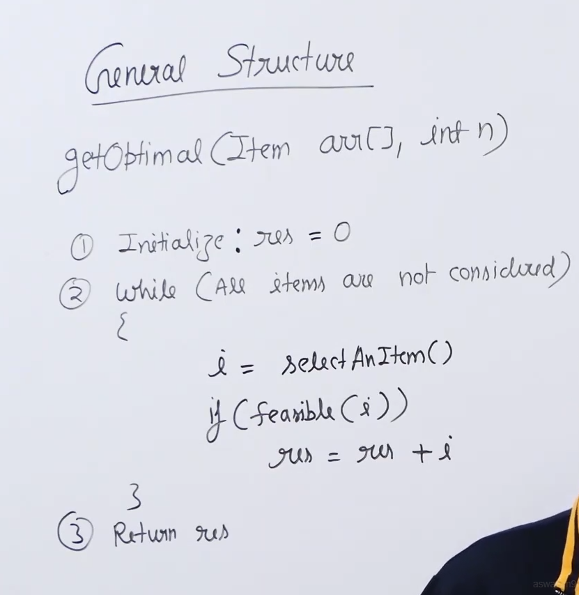
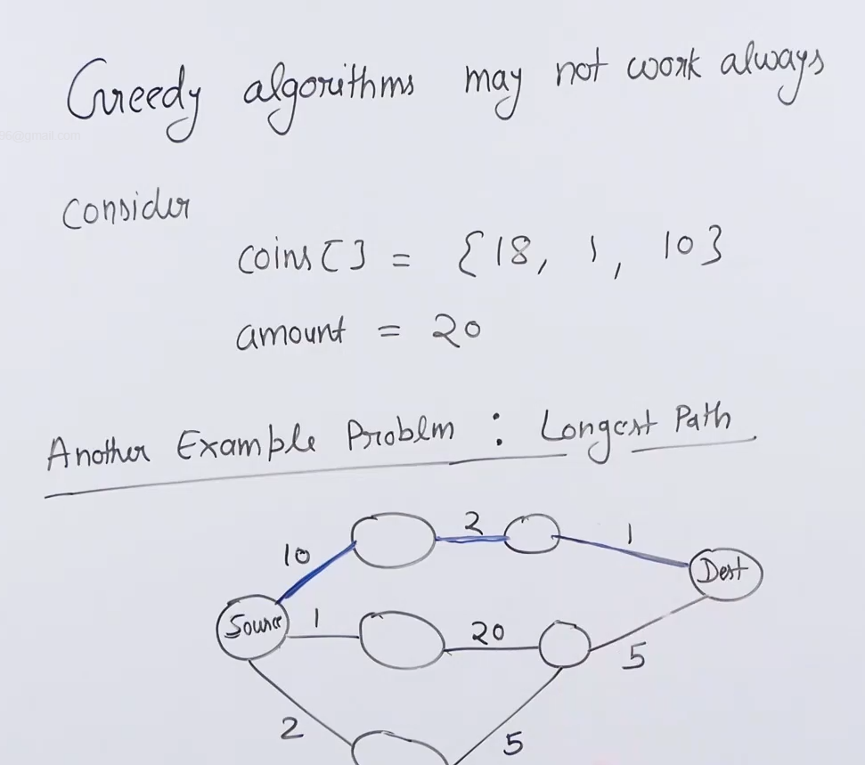
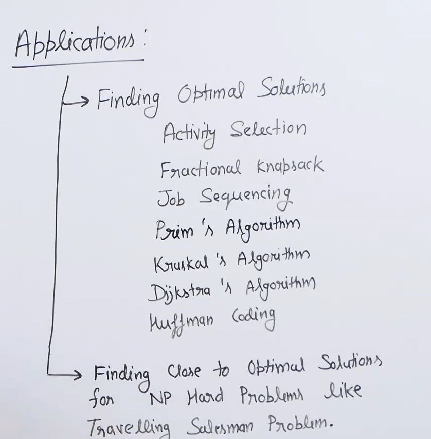

# Greedy algorithms :

* Mainly useful for optimization problems ( problems in which we need to maximize of minimize something).

* General structure of greedy algorithms : 

* So the idea of greedy algorithms where we pick the best looking solution at every step may not work always. 

* 

* For NP hard problems ( problem which cannot be solved in polynomial time) greedy provides close to optimal solution. Eg : travelling salesman problem.

