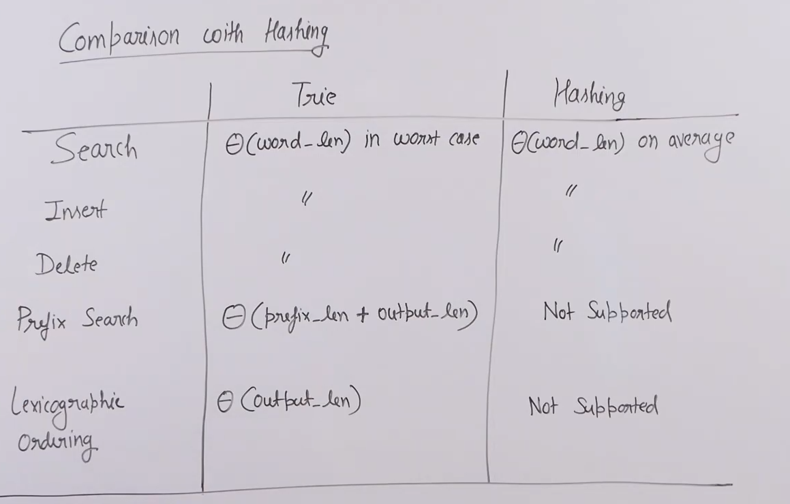

# Trie :

* Trie is a data structure which is used for the efficient implementation of dictionary.

* Efficient for the following operations on words in a dictionary : 
    1) Search
    2) Insert
    3) Delete
    4) Prefix search
    5) Lexicographical ordering of words.

* Prefix search : means finding out all the words which begin with a particular prefix.

* Trie can also be used to efficient print all the words in a lexicographical order.

## Comparision with hashing :

* 

* Hashing too requires O(word length) since it need to calculate the hash function for the string.