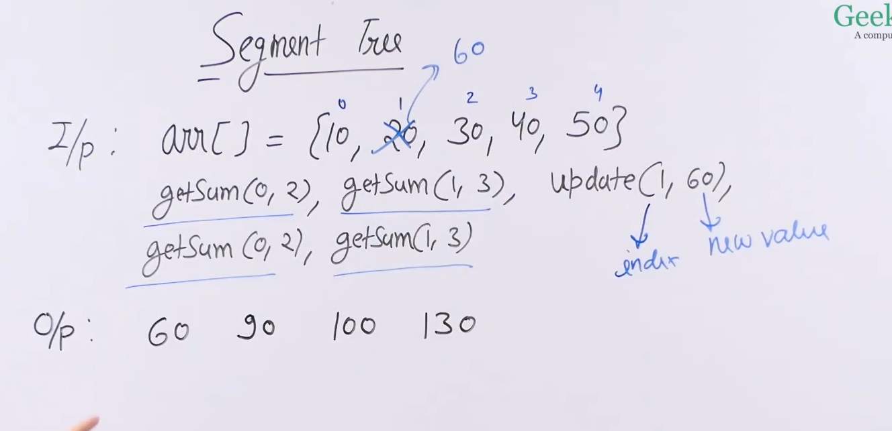
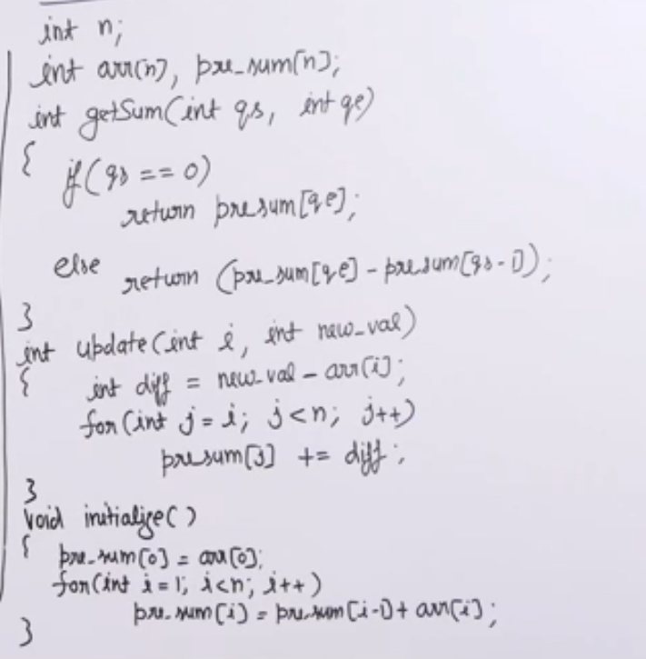
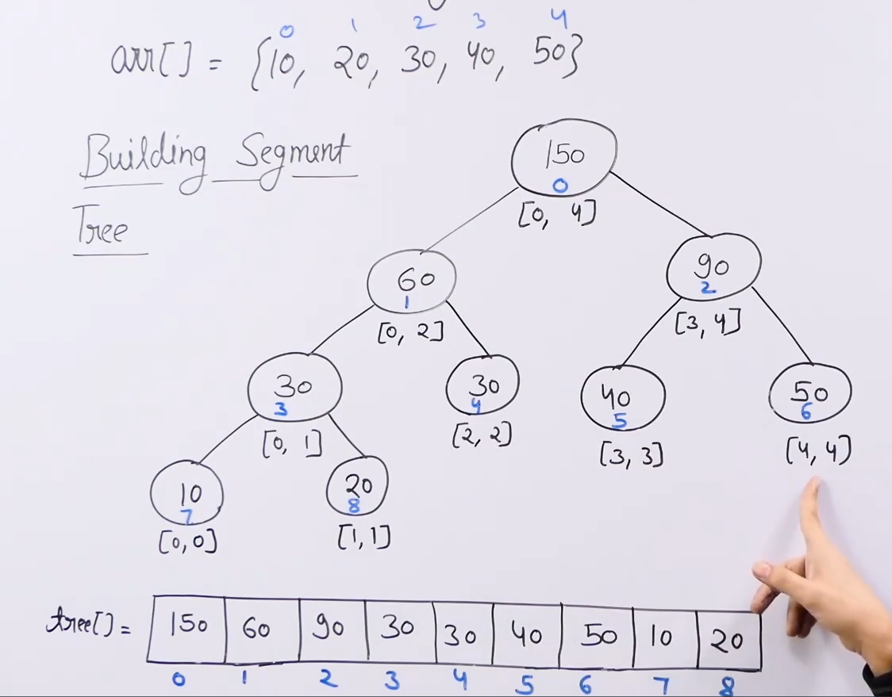
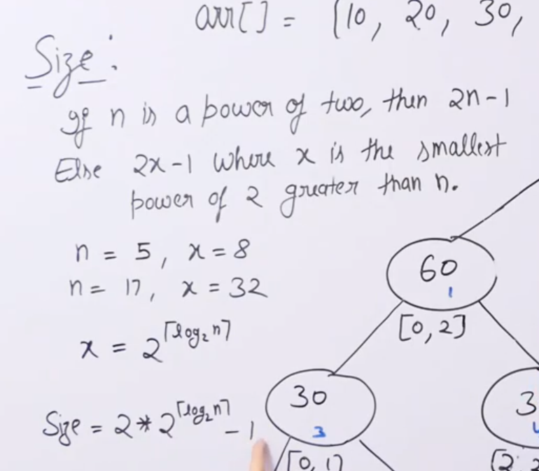
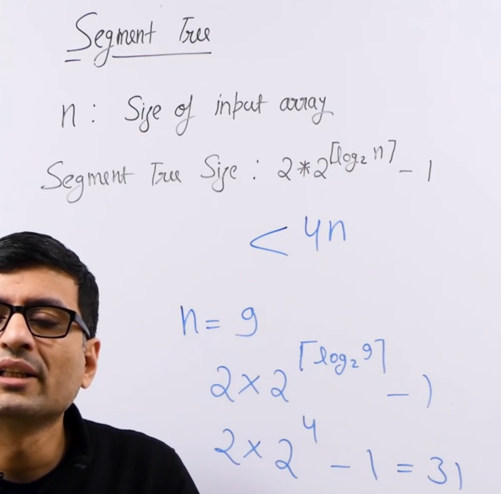

# Segment tree :

* Used for fixed sized arrays and following two types of operations :
    1) Range query : In this we will be given a pair of indices and we need to query search something in this range. O(logn) typically
    2) Update a value : In this we will be given a value and a index and we need to change the value at this index to this value. O(logn) typically

* We first need to build the segment tree to perform range query and update queries efficiently.

* Building a segment tree requirres theta(n) preprocessing time and theta(n) auxillary space.

* Segment trees are generally represent as arrays so we have a input array and we build a segment tree and hence it takes theta(n) auxillary space.

* Example of a problem which requires segment tree : 

* Methods to solve the above problem :  
    * Method 1: Calculate sum for each index range O(n) and update the values in an array O(1)

    * Method 2: Calculate the sum using prefix sum ,which stores the sum of all values from 0 to n ,technique so getSum take O(1) and update takes O(n) coz we need to update the prefix sums from i to n.

    * This solution also takes O(n) time for preprocessing and takes O(n) auxillary space.

    * 

* Segment tree solution to the above problem :
    * 

    * We build a segment tree and store it in an array just like heap. Each element in the array represents the sum of elements in a range.

    * Root represents the sum of all elements and leaves represent sum of single elements.

    * Internal nodes have sum of elements more than one.

    * Also in this problem we keep on diving the array and storing the sum of those divided part in each segment tree node.

    * In this problem the segment tree will have sum of its children.

    * Segment tree is different from heap in the fact that its not a complete binary tree and hence to maintain the left, right and parent relation of heap we create dummy nodes in the tree.

    * 

    * Basically the number of nodes in the last level must be greater than the total number of elements in the input array.

    * Also instead of remembering this complex equation we can upper bound the size by 4n.

    * 

