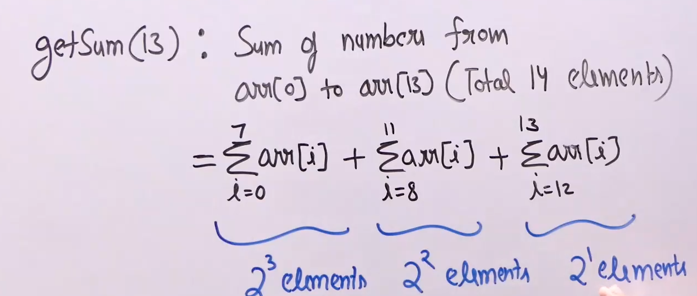
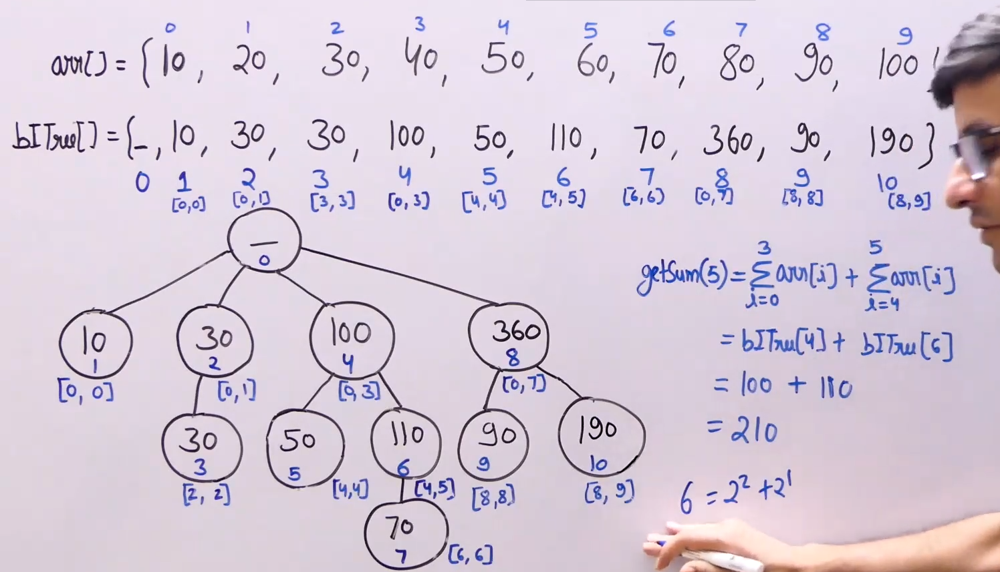
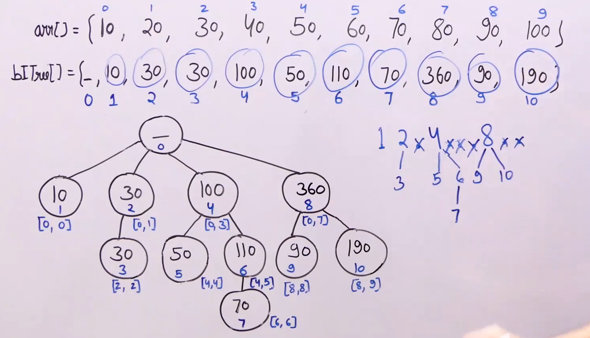
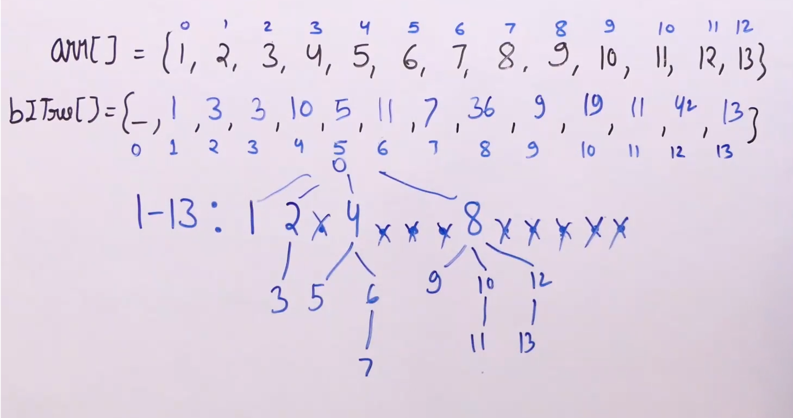
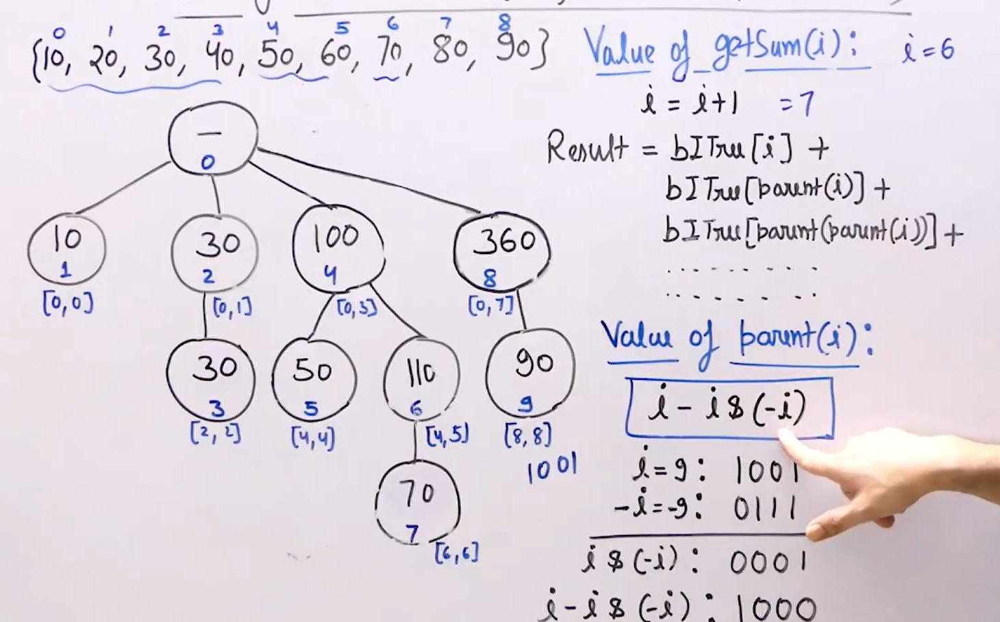
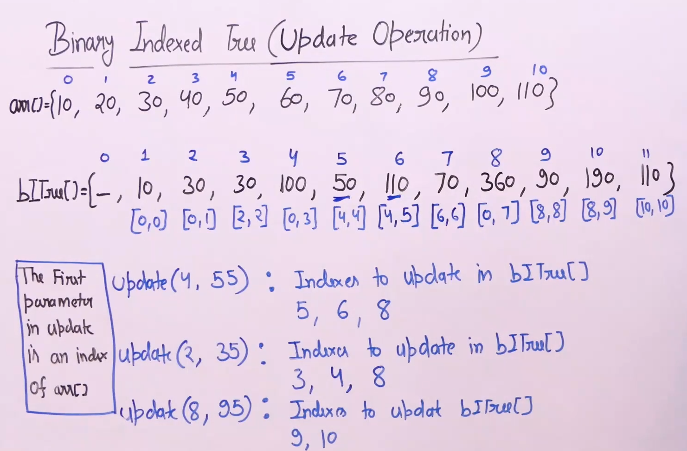
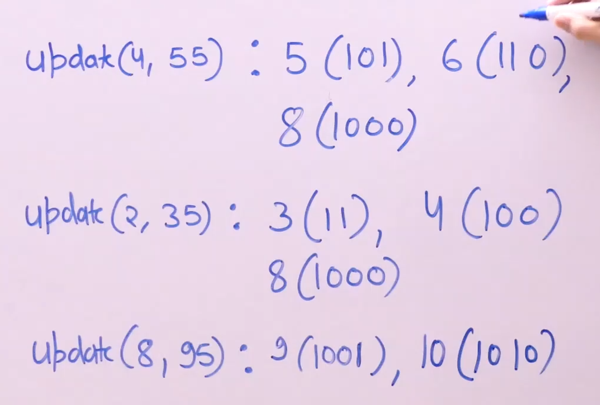

# Binary indexed tree / Fenwick tree :

* Used for fixed input array and multiple queries of the following types : 
    * Prefix operations (sum,product,xor,or) : find one of the above of all the elements from beginning to the given index. (O(logn))

    * Update a value. (O(logn))

* It is actually an array, but the concept is tree based.

* The difference between binary indexed tree and segment tree is that binary indexed is not a binary tree ds and nodes may have more than two children.

* Requirres O(nlogn) preprocessing time and Theta(n) auxillary space.

* To build the binary indexed tree we use update operation which takes logn time hence it takes nlogn time overall.

* We can perform all the operations of binary index tree by segment tree but segment tree is harder to implement also it takes more time since its upper bounded by 4logn and binary index tree is upper bounded by logn.

* Also segment tree requires array of size 4*n whereas binary index tree requires n+1.

* Also binary index trees can also be used for range queries. For eg : range(i,j) = prefix(i)-prefix(j).

* But we cannot use binary index tree for all the problems of segment tree eg : max min in range.

* Binary index tree is a better options.

## Prefix sum query :

* To get the sum of elements from 0 to n we divide the elements into groups of sizes of power of 2.

* 

* In binary index tree we will create an array which will quickly give us these values. 

* So binary index tree stores sum of ranges such that range size are power of 2 and using these sums we will get these values quickly.

* And total ranges we need to add to find the answer will always be less than logn since number of set bits will always be less than logn.

* Binary index tree will be of size of input.size()+1.

* Every node in the binary index tree represent sum of  ranges of size of power of 2.

* 

## Constructing a binary index tree :

* To construct a BIT we break the ranges in powers of 2.

* And every power of 2 represents the sum of elements from 0 to power of 2 - 1.

* To fill rest of the positions we further divide those ranges in powers of 2 and it will be a child of the element just before it.

* 

* 

## Finding the prefix sum :

* To find the prefix sum at n we find the node which gives us the sum of n,n (which is at index i+1 of the BIT) and then we add the sum of its parents which will give us the sum of [0,n].

* 

* To find the parent of a node for we just need to turn off the last set bit and we can do that by i-(i&(-i)).

## Updating the values :

* 

* 

* To update a value we must update all the ranges which contain that value and we can see that we can obtain all the indices of the BIT representing the ranges which the new number by just adding one to the last set bit of the index+1.

