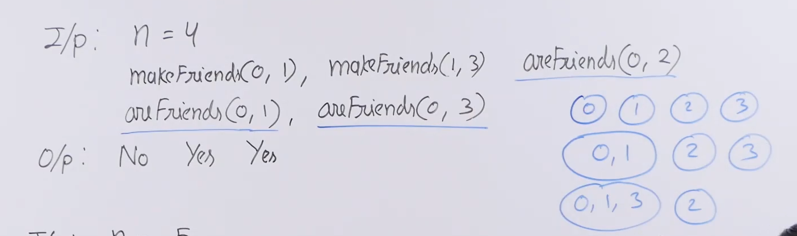
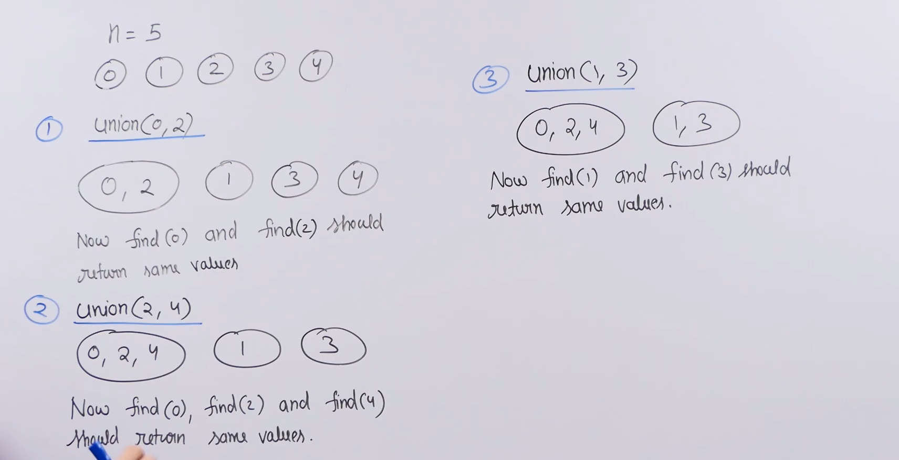

# Disjoint set data structure :

* To solve problems like the following , in which we are given some number of people or nodes and we have two types of operations. 1) Make friends or join, 2) Check if two people are friends or not. To solve these types of problems efficiently we use disjoint set data structure.

* 

* **Simple solution** :
    * To consider this as a undirected graph and use either adjacency list or adjacency matrix.

    * To make friends between two people we add each them to other's adjacency list or matrix as well as other's friends adjacency list or matrix.

    * To check if two people are friends we just search them in each others adjacency list or matrix.

    * Adjacency list : makeFriends() - O(n) , areFriends() - O(n).

    * Adjacency matrix : makeFriends() - O(n) , areFriends() - O(1).

* **Better solution(Disjoint set)** :
    * Disjoint set can be used in any problem where we have a big universe or a set and we have multiple subsets of it as disjoint subsets.

    * So basically whole set is partitioned into multiple disjoint subsets (no two subsets have anything in common).

    * Disjoint set supports two operations : 
        * Find : returns a representative of x's set (or social network) 
        *union : combines sets of x and y (same as makeFriends())

    * For this problem union is same as makeFriends and it combines the sets of x and y.

    * AreFriends function involves two calls of the find function and is used to compare the representative of x and y.

    * Find function returns a value which is same for all the elements of that disjoint set.

    * 

    
